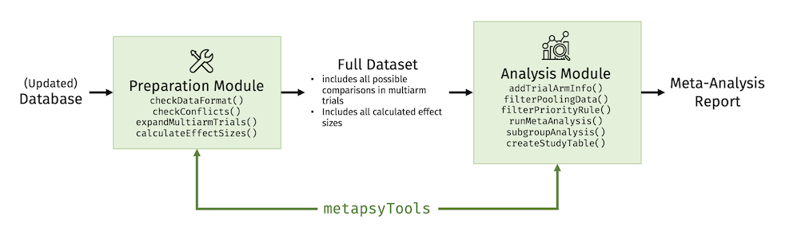
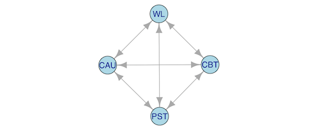
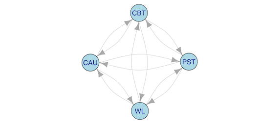
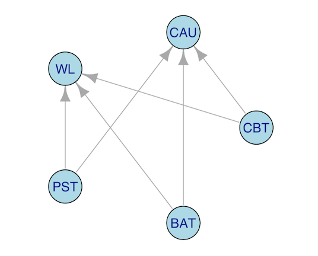
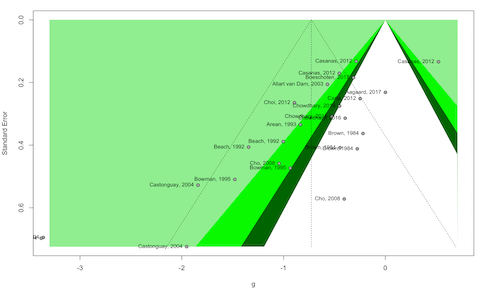
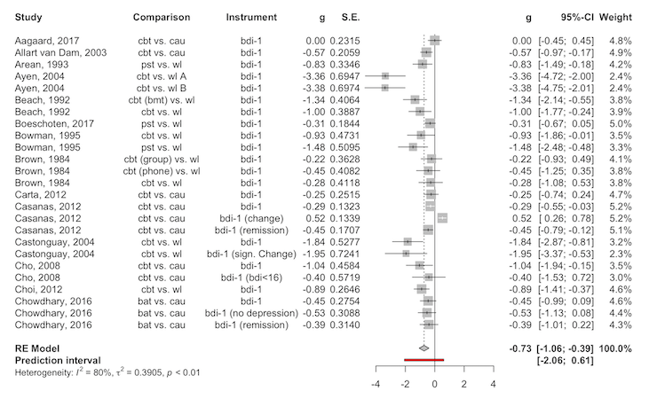

## Introducing `metapsyTools`

The `metapsyTools` package facilitates the calculation of effect sizes (i.e. Hedges' $g$) and meta-analyses based on the **Metapsy** database (or databases adhering to the same format).

The package consists of **two modules**:

1. A module to check the data format and calculate effect sizes for all possible study comparisons (**preparation** module);
2. A module to select relevant comparisons for a specific meta-analysis, calculate the results (including subgroup analyses), and generate tables (**analysis** module).

The idea is to use the two modules in different contexts. For example, the **preparation** module can be used every time the database is updated to gather all information, calculate effect sizes, and bring the data into a format suitable for further analyses. 

This final dataset then builds the basis for the **analysis** module. Researchers simply have to filter out the comparisons that are relevant for their investigation, and can then use functions of the package to run a full meta-analysis, including sensitivity and subgroup analyses.

<br>

{width=685px}

<div style="border: 1px solid black; bg-color: gray; padding: 10px; border-radius: 3px;"><strong>Important</strong>: The preparation module requires a familiarity with the general structure of the database, as well as intermediate-level knowledge of R and the `metapsyTools` package itself, in order to diagnose (potential) issues. We advise that the preparation step (i.e. checking the data format, expanding multiarm trials, and calculating effect sizes each time the database is updated) should be conducted by a person with some proficiency in R & data wrangling. The analysis module, on the other hand, should be usable by all researchers.</div>

<br>

## The Preparation Module

The preparation module in `metapsyTools` allows to:

- check if the classes of variables in the imported data set are as required, using `checkDataFormat`
- check for formatting conflicts which have to be resolved prior to any further steps, using `checkConflicts`
- expand multiarm trials, thereby creating two rows in the data set for each possible treatment arm combination in each multiarm trial, using `expandMultiarmTrials`
- calculate Hedges' $g$ for each comparison, provided suitable data is available, and generate a data set ready for meta-analyses, using `calculateEffectSizes`.

### Required Structure of the Database

For your own convenience, it is highly advised to **strictly** follow some data formatting rules prior to importing the dataset for effect size calculation. If all of these rules are followed closely, it minimizes the risk of receiving error messages, producing conflicts, etc.

We assume that the database follows the general structure of the Metapsy database, in which **each row represents a specific result of one trial arm** (e.g. the measured self-reported depression severity in the control group at post-test in some study x).

First, the database **must** contain these columns, with **exactly** this variable name:

- **`study`**. The name and year of the study the result was extracted from, as a `character` variable, e.g. `"Cuijpers, 2019"`. This variable should **not** differ between study arms, measurement points, etc.  
- **`condition`**. A `character` variable, representing if the trial arm served as the control group (`"cg"`) or intervention group (`"ig"`) in this specific trial. Overall, `condition` must only contain `"cg"` or `"ig"` values.
- **`Cond_spec`**. A `character` variable, representing the "condition specification". This variable encodes the type of intervention/control group employed in the trial arm (e.g. `"cau"` for care as usual, or `"pst"` for problem-solving therapy). **_NOTE_**: for multiarm trials, this variable encodes the different treatment in each trial arm. In multiarm trials, `Cond_spec` **must** have different values in differing treatment arms. Say, e.g., that one trial consisted of conditions PST online, PST face-to-face, and a wait-list. Here, we still use `"pst"` to specify that Problem-Solving Therapy was employed; but in brackets, we add the "special" subtype of PST to uniquely identify the two intervention arms. In sum, the values for this trial in `Cond_spec` would therefore be `"pst (online)"`, `"pst (f2f)"` and `"wl"`.
- **`multiple_arms`**. A `character` variable. This variable should be `NA` when a trial arm is not part of a multiarm study. When the arm _is_ part of a multiarm trial, this variable should have the same value as in `Cond_spec`.
- **`is.multiarm`**. A `numeric` variable which indicates if a trial arm is _not_ part of a multiarm study (`0`, i.e. the study only has one intervention and one control group) or is part of a multiarm study (`1`).
- **`no.arms`**. A `numeric` variable, indicating the number of arms in one trial. In non-multiarm trials, this should be `2`. 
- **`Outc_measure`**. A `character` variable, indicating the type of instrument used to measure the results (e.g. `"phq-9"`). If the same instrument was used to measure **several** quantities in one study, the type of outcome **must** be added in brackets, for example `"hdrs (response)"` and `"hdrs (remission)"`.
- **`Time`**. A `character` variable, indicating the assessment point (e.g. `"baseline"` or `"post"`).
- **`Time_weeks`**. A `character` variable, indicating the assessment point in time units (e.g. `"2 month"` or `"0"`). Can be `NA` in case no information was reported.
- **`primary`**. A `numeric` variable, indicating if the row contains results of the trial's primary outcome (`1`) or not (`0`).
- **`sr_clinician`**. A `character` variable, representing if an outcome was self-reported (e.g. `"self-reported"`), or assessed in some other way (e.g. `"clinician"`-rated). 
- **`rob`**. A variable indicating how many risk of bias criteria were fulfilled. This variable is not essential but expected by default in, for example, `runMetaAnalysis`.
- **`...`** Further variables to be used (among other things) for subgroup analyses, study details in the meta-analysis publication, meta-regression, or to define treatment types analyzed in network meta-analyses, and so forth.

**The following variables have to be added to calculate effect sizes** (all of class `numeric`):

- Mean, SD and N:
  - **`Post_M`**. The mean of the measured outcome in the trial arm, if applicable. Otherwise, leave as `NA`.
  - **`Post_SD`**. The sample standard deviation of the measured outcome in the trial arm, if applicable. Otherwise, leave as `NA`.
  - **`Post_N`**. The sample size of the trial arm, if applicable. Otherwise, leave as `NA`.
- Change Scores:
  - **`Change_m`** (note the lowercase "m"!). The mean pre-post change in the trial arm, if applicable. Otherwise, leave as `NA`.
  - **`Change_SD`**. The sample standard deviation of the change scores in the trial arm, if applicable. Otherwise, leave as `NA`.
  - **`Change_N`**. The sample size of the trial arm, _if_ change scores are used. Otherwise, leave as `NA`, particularly when data for `Post_M` and `Post_SD` are available in the same row.
- Response, Remission, ...
  - **`Improved_N`**. The number of individuals in the trial arm who have _improved_. It is crucial that the outcome should be positive/desired (i.e. remission, response, but _not_ e.g. deterioration) to ensure that the calculated effect sizes have the correct sign in the end!
  - **`Rand_N`**. If the row contains improvement data: the number of individuals in the trial arm. Otherwise, leave as `NA`, particularly when data for `Post_M` and `Post_SD`, or `Change_m` and `Change_SD` are available in the same row.


**Further remarks** concerning the required data structure:

- Often, it will not be possible to calculate the effect size data for all comparisons (e.g. because they reported their results in an "exotic" format, or because only the calculated value of $d$ or $g$ was reported). In this case, leave all effect size data variables in the dataset as `NA`. After using `calculateEffectSizes`, these comparisons will simply be forwarded without any calculations, and have `NA` in the calculated effect size and standard error columns. These gaps can then be filled manually by simply inserting the calculated $g$ and $\sqrt{V_g}$ values in the `es` and `se` columns generated by `calculatedEffectSizes` to "fill the gaps". When the database is updated the next time, this leads to a temporary loss of the manually calculated effect sizes (the rows with manually calculated effect sizes will again be `NA` if the functions are used on the entire updated database). However, this should not be a large issue. The `calculateEffectSizes` function creates a unique `id` variable in the final dataset for each comparison. This ID can be used to match comparisons with their manually calculated effect sizes from the last update again. 
- The `study` variable should be identical for all arms (and outcomes measured in that arm) provided by the same study. However, there is one exception. When results are consistently reported separately for subgroups within the trial (e.g. M, SD and N for patients with and without a clinical diagnosis, for all trial arms), these subgroups should be treated as _independent_ studies (or alternatively, the results can be pooled to obtain overall data). This means that the `study` variable has to be adapted in this very special case to differentiate between the subgroups. This can be done by adding the subgroup in brackets, e.g. `"Dimidjan, 2005 (no diagnosis)"` and `"Dimidjan, 2005 (diagnosis)"`.
- Each comparison/row can only contain effect size data for one effect size data type as declared above (Mean, SD, N _or_ Change Scores _or_ Response/Remission), but for the selected effect size data type, **all** required data must be available (e.g. if `Post_M` and `Post_N` are provided, one _must_ also provide data for `Post_SD`).
- Effect size data should only be added if this specific outcome (e.g. PHQ-9 at post-test) was assessed in _all_ trial arms. It is not possible to add effect size data that was only measured in some arms within one trial, but not all.
- Please do _not_ include a variable with the name "id", "es", or "se" in the original data file, because these are added later. See "Calculation of Hedges' $g$" for more information.


### Data Format & Conflict Check

Once the data set has been pre-structured correctly, `metapsyTools` allows you to check the required variable format and control for potential formatting conflicts.

If the formatting rules above are followed, none of the default behavior of the preparation module has to be changed. At first, one can run `checkDataFormat`. As an illustration, we will use the `database2021Subset` data frame, which is directly available after installing `metapsyTools`.

```{r, eval=F}
library(metapsyTools)
data("database2021Subset")
database2021Subset <- checkDataFormat(database2021Subset)
```

```
## - [OK] data set contains all variables in 'must.contain'.
## - [OK] variables contain only the values specified in 'variable.contains'.
## - [OK] 'study' has desired class character.
## - [OK] 'condition' has desired class character.
## - [OK] 'Cond_spec' has desired class character.
## - [OK] 'is.multiarm' has been converted to class numeric.
## - [OK] 'no.arms' has desired class numeric.
## - [OK] 'multiple_arms' has desired class character.
## - [OK] 'primary' has desired class numeric.
## - [OK] 'Time' has desired class character.
## - [OK] 'Time_weeks' has desired class character.
## - [OK] 'sr_clinician' has desired class character.
## - [OK] 'Post_M' has desired class numeric.
## - [OK] 'Post_SD' has desired class numeric.
## - [OK] 'Post_N' has desired class numeric.
## - [OK] 'Rand_N' has desired class numeric.
## - [OK] 'Improved_N' has desired class numeric.
## - [OK] 'Change_m' has desired class numeric.
## - [OK] 'Change_SD' has desired class numeric.
## - [OK] 'Change_N' has desired class numeric.
```

We see that the function has checked the required variables and their class. If divergent, the function will also try to **convert** the variable to the desired format. 

<div style="border: 1px solid black; bg-color: gray; padding: 10px; border-radius: 3px;"><strong>Required variables for unique IDs</strong>: To function properly, the `metapsyTools` functions must be able to generate a _unique_ ID for each comparison. By default, this is achieved by combining information of the `study`, `condition`, `Cond_spec`, `is.multiarm`, `no.arms`, `multiple_arms`, `Outc_measure`, `Time`, `primary`, `Time_weeks`, and `sr_clinician` variables. These variables are included by default in the `must.contain` argument in the `checkDataFormat` function. If all required variables are detected, an `OK` message is returned; as is the case in our example.</div>


We can also check the data for potential formatting issues, using the `checkConflicts` function.

```{r, eval=F}
database2021Subset <- checkConflicts(database2021Subset) 
```
```
## - [OK] No data format conflicts detected
```


In our case, no data format conflicts were detected. This is because all the data were pre-structured correctly. If data conflicts exist, the output looks similar to this:

```
## - [!] Data format conflicts detected!
## ID conflicts 
## - check if the specified number of arms is correct 
## - check if selected variables really create unique assessment point IDs 
## - check if 'Cond_spec' uniquely identifies all trial arms in multiarm trials 
## --------------------
## Ammerman, 2013
## Arean, 1993
## Bedard, 2014
## Burns, 2013
## Carr, 2017
## Choi, 2012
## Ebert, 2018
## Freedland, 2015
## Hautzinger, 2004
## Hummel, 2017
## Johansson, 2012a
## 
## Trials with 2+ control groups 
## - NOTE: As of version 0.2.0, 'metapsyTools' can handle 2+ control groups! 
## --------------------
## Ammerman, 2013
## Arean, 1993
## Bedard, 2014
## Burns, 2013
## Carr, 2017
## Choi, 2012
## Ebert, 2018
## Freedland, 2015
## Hautzinger, 2004
## Hummel, 2017
## Johansson, 2012a
```

Note: Since version 0.2.0 the `Trials with 2+ control groups` section studies are not regarded as data conflicts anymore, because the functionality can now handle 2+ control groups. `ID conflicts`, however, will always have to be fixed before proceeding. ID conflicts indicate that unique comparison IDs could not be created for all results.

<br>

### Expanding Multiarm Trials

After all data format conflicts are resolved, one can process to **expand multiarm trials**. This means that for each possible comparison within a multiarm trial, there will be two rows in the data set, representing the two arms that are being compared. This is a prerequisite to calculate all possible between-group effect sizes later on. 

Imagine that one multiarm study compared CBT, PST, CAU and a waitlist (i.e. a four-arm trial). Under these conditions, there are $\binom{4}{2} = \frac{4!}{2!(4-2)!} = 6$ distinct arm combinations. We can represent this as a graph with 6 distinct arrows; each double arrow stands for one possible combination:


```{r, eval=F, echo=F}
library(igraph)
vertex = c("CBT","PST", "CBT","CAU", "CBT","WL", "PST","CBT", "PST","CAU", "PST","WL", "CAU","CBT", "CAU","PST", "CAU","WL", "WL","CBT", "WL","PST", "WL","CAU")
g1 <- graph(edges=vertex, n=4, directed=TRUE) 
plot(g1, vertex.size = 35, vertex.color = "lightblue",
     vertex.label.family="Helvetica")
```

<center>
{width=200px}
</center>

In this example, 12 rows would be included after running `expandMultiarmTrials`, with 6 row pairs each corresponding with one of the 6 unique combinations. 

We can try this out with our `database2021Subset` data set, saving the result as `database2021SubsetExpanded`, and exploring the number of added rows after expansion.

```{r, eval=F}
database2021SubsetExpanded <- expandMultiarmTrials(database2021Subset)
nrow(database2021SubsetExpanded) - nrow(database2021Subset)
```
```
## - [OK] Multiarm trial expansion successful
## [1] 169
```

We see that the expansion was successful, and that 169 rows were added in the process.

<br>

### Calculation of Hedges' $g$

After the multiarm expansion, the effect size ($g$) and its variance can be calculated for all comparisons, using `calculateEffectSizes`. When applying `calculateEffectSizes`, the effect size functions specified in the `funcs` argument are applied by default, which means that effect sizes based on Mean, SD and N, Change Scores and binary outcomes can be calculated. 

The function also transforms the provided data set from the "longer" format (one row per arm) to a "wider" format, in which each comparison corresponds with one row. Sometimes, however, information may _differ_ between trial arms (e.g. the proportion of women included in each arm, or the overall treatment type). The `calculateEffectSizes` function handles this by automatically generating two columns with suffixes `_trt1` and `_trt2` for each variable with _differing values_ within one comparison. This means that no information that differs between comparison arms is lost.

The data set returned by `calculateEffectSizes` also includes a new variable `id` (Note: therefore, please do _not_ include a variable with the name "id" in the original data file, because this is added later). This ID uniquely identifies each comparison.

The calculated effect size, Hedges' $g$ and its standard error, are saved in columns `es` and `se`, respectively, in the data frame returned by `calculateEffectSizes`. Therefore, please do _not_ include a variable with the name "es" or "se" in the original data file. 

When the data are pre-structured as described above, no further specifications are needed to use `calculateEffectSizes`; only the _expanded_ (!) dataset has to be provided. We save the result as `data`.

```{r, eval=F}
data <- calculateEffectSizes(database2021SubsetExpanded)
data[,c("id", "es", "se")]
```

```
## - Calculating effect sizes...
## - [OK] Effect sizes calculated successfully
##                                                   id      es     se
## 1                         Aagaard_2017_1_bdi-1_ba... -0.1939 0.2244
## 2                         Aagaard_2017_1_bdi-1_po...  0.0000 0.2314
## 3                             Abas_2018_0_dssq_ba... -0.5054 0.3621
## 4                                Abas_2018_0_dssq... -0.5516 0.3864
## 5                            Abas_2018_1_phq-9_ba...  1.5594 0.4086
## 6                               Abas_2018_1_phq-9... -0.7104 0.3913
## 7   Ahmadpanah_2016_1_bdi-1_baseline_0_self-repor...  0.7715 0.3792
## 8         Ahmadpanah_2016_1_bdi-1_baseline_0_self...  0.4126 0.3692
## 9        Ahmadpanah_2016_1_bdi-1_baseline_0_self-... -0.3286 0.3677
## 10 Ahmadpanah_2016_1_bdi-1_post_2month_self-repor...  0.3182 0.3675
## 11       Ahmadpanah_2016_1_bdi-1_post_2month_self... -1.5681 0.4202
## 12      Ahmadpanah_2016_1_bdi-1_post_2month_self-... -1.7788 0.4347
## 13                         Alexopoulos_2016_1_hdr...      NA     NA
## 14              Alexopoulos_2016_1_hdrs(remission...  0.1700 0.1782
```

Looking at the column names, we also see that variables that differ between trial arms within one comparison have been split into two variables with suffixes `_treat1` and `_treat2`, where `_treat1` represents the reference treatment.

```{r, eval=F}
colnames(data)
```

```
##  [1] "study"                              "id"                                
##  [3] "id_study_condition_instrument_trt1" "id_study_condition_instrument_trt2"
##  [5] "condition_trt1"                     "condition_trt2"                    
##  [7] "arm_format_trt1"                    "arm_format_trt2"                   
##  [9] "outcome_type"                       "outc_instrument"                   
## [11] "sr_clinician"                       "dich"                              
## [13] "dich_type"                          "change"                            
## [15] "other_statistic_trt1"               "other_statistic_trt2"              
## [...]                          
## [71] "Post_N_trt2"                        "Post_SD_trt1"                      
## [73] "Post_SD_trt2"                       "Post_M_trt1"                       
## [75] "Post_M_trt2"                        "type_trt1"                         
## [77] "type_trt2"                          "Time_weeks"                        
## [79] "Time"                               "Outc_measure"                      
## [81] "no.arms"                            "is.multiarm"                       
## [83] "Cond_spec_trt1"                     "Cond_spec_trt2"                    
## [85] "es"                                 "se" 
```

<br>

Please note that the current version of the data set only includes all unique treatment arm **combinations**, not all _unique_ **comparisons**. Let us use the four-arm trial example (CBT, PST, CAU and a wait-list) again. While this trial provides 6 unique trial arm combinations, the number of unique _comparisons_ is higher: $\frac{n!}{(n-k)!} = \frac{4!}{2!} = 12$. 

This is because the sign of the calculated effect size depends on which treatment serves as the _reference_. The effect of CBT vs. PST, for example, depends on which arm serves as the reference group (i.e. CBT-PST or PST-CBT). Depending on which arm is chosen (and assuming non-zero mean differences), the calculated Hedges' $g$ value will either be negative (e.g. $g$=-0.31) or positive ($g$=0.31). We see this visualized in the graph below. There are now two directed arrows for each comparison (12 in total), and each arrow reads as "is compared to":

<center>
{width=200px}
</center>

To truly calculate all unique _comparisons_, we have to set the `include.switched.arms` argument to `TRUE` when running `calculateEffectSizes`. 

```{r, eval=F}
data <- calculateEffectSizes(database2021SubsetExpanded,
                             include.switched.arms = TRUE)
data[1:10, c("id", "Cond_spec_trt1", "Cond_spec_trt2", "es")]

```

```
##                                              id Cond_spec_trt1 Cond_spec_trt2      es
## 1               Aagaard_201...e_0_self-reported            cbt            cau  -0.193
## 2  Aagaard_2017_1_bdi-1_bas...rted_arm_switched            cau            cbt   0.193
## 3               Aagaard_201...ear_self-reported            cbt            cau   0.000
## 4  Aagaard_2017_1_bdi-1_pos...rted_arm_switched            cau            cbt   0.000
## 5                   Abas_20...e_0_self-reported            pst            cau  -0.505
## 6      Abas_2018_0_dssq_bas...rted_arm_switched            cau            pst   0.505
## 7                      Abas..._NA_self-reported            pst            cau  -0.551
## 8         Abas_2018_0_dssq_...rted_arm_switched            cau            pst   0.551
## 9                  Abas_201...e_0_self-reported            pst            cau   1.559
## 10    Abas_2018_1_phq-9_bas...rted_arm_switched            cau            pst  -1.559
```

The resulting data frame `data` now follows a "wider" format and includes all effect sizes that can theoretically be calculated. As a last step, one has to manually add the effect sizes and standard errors of comparisons for which `calculateEffectSizes` returned `NA`. This leads to a final data set which can be used with the **analysis module**, which will be described next.

<div style="border: 1px solid black; bg-color: gray; padding: 10px; border-radius: 3px;"><strong>Should I use `include.switched.arms`?</strong> It is not essential to calculate all possible arm comparisons, because, for Hedges' $g$, reference groups can always be "switched" by multiplying the calculated effect size by -1. However, having all possible comparisons in your data set is convenient, because all required comparisons pertaining to a particular research question (e.g. "how effective is PST when CBT is the reference group?") can directly be filtered out; there is typically no need for further data manipulation steps.</div>


<br>

## The Analysis Module

The analysis module in `metapsyTools` allows to run different kinds of meta-analyses based on the final data set created by the preparation module. It is designed to also be usable by researchers who were not directly involved in the preparation step, and is less demanding in terms of required background knowledge.

The analysis module allows to:

- Filter data using strict rules, fuzzy string matching, or by implementing prioritization rules (`filterPoolingData` and `filterPriorityRule`). 
- Run conventional (random-effects) meta-analysis models as well as commonly reported sensitivity analyses (`runMetaAnalysis`)
- Run subgroup analyses based on the fitted model (`subgroupAnalysis`)
- Create study information tables (`createStudyTable`).

<br>

### Filtering Relevant Comparisons

The `metapsyTools` package contains functions which allow to flexibly filter out comparisons that are relevant for a particular meta-analysis.

The `filterPoolingData` function is the main function for filtering. We simply have to provide the final data set with calculated effect sizes (see preparation module), as well as one or several filtering criteria pertaining to our specific research question.

Say that we want to run a meta-analysis of all studies in which CBT was compared to wait-lists, with the BDI-II at post-test being the analyzed outcome. We can filter out the relevant comparisons like this:

```{r, eval=FALSE}
data %>% 
  filterPoolingData(Cond_spec_trt1 == "cbt",
                    Cond_spec_trt2 == "wl",
                    outc_instrument == "bdi-1",
                    Time == "post") %>% nrow()
```
```
## [1] 6
```

We see that $k$=6 comparisons fulfill these criteria. Note, however, that this will only select comparisons for which `Cond_spec` was _exactly_ defined as `"cbt"`. For multiarm trials, it is necessary to add specifications in brackets (e.g. `"cbt (online)"`) to make the conditions in each arm unique. To filter out _all_ comparisons which applied some form of CBT, we need to apply **fuzzy matching**. This can be achieved by using the `Detect` function within `filterPoolingData`:

```{r, eval=F}
data %>% 
  filterPoolingData(Detect(Cond_spec_trt1, "cbt"),
                    Detect(Cond_spec_trt2, "wl"),
                    outc_instrument == "bdi-1",
                    Time == "post") %>% nrow()
```
```
## [1] 11
```

We see that now, $k$=11 CBT vs. wait-list comparisons were detected. 

We can create even more complex filters. Say that we want to examine the effect, as measured by the BDI-I at post-test, of CBT, PST, and BAT compared to _either_ CAU or wait-lists. We can visualize this with a graph again:

```{r, eval=F, echo=F}
library(igraph)
vertex = c("CBT", "CAU", "CBT", "WL", "PST", "CAU", "PST", "WL", "BAT", "CAU", "BAT", "WL")
g1 <- graph(edges=vertex, directed=TRUE) 
plot(g1, vertex.size = 35, vertex.color = "lightblue",
     vertex.label.family="Helvetica", layout=layout.circle)
```

<center>
{width=200px}
</center>


We can use the OR-Operator `|` within `filterPoolingData` for such filter types. Again, we use the `Detect` function to allow for fuzzy matching:

```{r, eval=F}
data %>% 
  filterPoolingData(Detect(Cond_spec_trt1, "cbt|pst|bat"),
                    Detect(Cond_spec_trt2, "cau|wl"),
                    outc_instrument == "bdi-1",
                    Time == "post") -> ma.data

ma.data %>% select(study, Cond_spec_trt1, Cond_spec_trt2)
```
```
                  study Cond_spec_trt1 Cond_spec_trt2
1         Aagaard, 2017            cbt            cau
2  Allart van Dam, 2003            cbt            cau
3           Arean, 1993            pst             wl
4            Ayen, 2004            cbt           wl A
5            Ayen, 2004            cbt           wl B
6         Barrera, 1979            bat             wl
7           Beach, 1992      cbt (bmt)             wl
8           Beach, 1992            cbt             wl
9      Boeschoten, 2017            pst             wl
10         Bowman, 1995            cbt             wl
11         Bowman, 1995            pst             wl
12          Brown, 1984    cbt (group)             wl
13          Brown, 1984    cbt (phone)             wl
14          Brown, 1984            cbt             wl
15          Carta, 2012            cbt            cau
16        Casanas, 2012            cbt            cau
17        Casanas, 2012            cbt            cau
18        Casanas, 2012            cbt            cau
19     Castonguay, 2004            cbt             wl
20     Castonguay, 2004            cbt             wl
21            Cho, 2008            cbt            cau
22            Cho, 2008            cbt            cau
23           Choi, 2012            cbt             wl
24      Chowdhary, 2016            bat            cau
25      Chowdhary, 2016            bat            cau
26      Chowdhary, 2016            bat            cau
```

<br>

Lastly, one can also filter data according to a specified **priority rule**, using the `filterPriorityRule` function. This is particularly helpful to select instruments. Say, for example, that we ordered certain instruments based on their known reliability. Now, for each study, we only want to select the comparison in which the most reliable instrument was used. It is possible that, for some studies, all used instruments are relatively unreliable. However, given our priority rule, we can still extract the comparison with a _relatively_ high reliability, and discard all the other measurements within one study that are even less reliable.

Assume that our priority rule for the employed instrument is `"hdrs"` (priority 1), `"bdi-2"` (priority 2), `"phq-9"` (priority 3) and `"bdi-1"` (priority 4). We can implement the rule like this:

```{r, eval=F}
data %>% 
  # First, filter all other relevant characteristics
  filterPoolingData(Detect(Cond_spec_trt1, "cbt|pst|bat"),
                    Detect(Cond_spec_trt2, "cau|wl"),
                    Time == "post") %>% 
  # Now, implement the priority rule for the outcome instrument
  filterPriorityRule(outc_instrument = c("hdrs", "bdi-2", "phq-9", "bdi-1")) %>% 
  # Show filter results
  select(study, Cond_spec_trt1, Cond_spec_trt2, outc_instrument)
```

```
##                   study Cond_spec_trt1 Cond_spec_trt2 outc_instrument
## 1         Aagaard, 2017            cbt            cau           bdi-1
## 2            Abas, 2018            pst            cau           phq-9
## 3  Allart van Dam, 2003            cbt            cau           bdi-1
## 4        Ammerman, 2013            cbt            cau            hdrs
## 5           Arean, 1993            pst             wl            hdrs
## 6           Arean, 1993            pst             wl            hdrs
## 7            Ayen, 2004            cbt           wl A           bdi-1
## 8            Ayen, 2004            cbt           wl B           bdi-1
## 9         Barrera, 1979            bat             wl           bdi-1
## 10          Beach, 1992      cbt (bmt)             wl           bdi-1
## 11          Beach, 1992            cbt             wl           bdi-1
## 12         Berger, 2011   cbt (guided)             wl           bdi-2
## 13         Berger, 2011 cbt (unguided)             wl           bdi-2
## 14     Boeschoten, 2017            pst             wl           bdi-2
## 15     Boeschoten, 2017            pst             wl           bdi-2
## 16         Bowman, 1995            cbt             wl            hdrs
## 17         Bowman, 1995            pst             wl            hdrs
## 18         Bowman, 1995            cbt             wl            hdrs
## 19         Bowman, 1995            pst             wl            hdrs
## 20          Brown, 1984    cbt (group)             wl           bdi-1
## 21          Brown, 1984    cbt (phone)             wl           bdi-1
## 22          Brown, 1984            cbt             wl           bdi-1
## 23          Burns, 2013            cbt            cau           phq-9
## 24           Carr, 2017            cbt            cau            hdrs
## 25          Carta, 2012            cbt            cau           bdi-1
## 26        Casanas, 2012            cbt            cau           bdi-1
## 27        Casanas, 2012            cbt            cau           bdi-1
## [...]
```


<br>

### Pooling Effects

After all relevant rows have been filtered out (in our case, these relevant comparisons are the ones we saved in `ma.data` previously), we can start to pool the effect sizes. The `runMetaAnalysis` function serves as a wrapper for several commonly used meta-analytic approaches, and, by default, applies them all at once to our data:

- `"overall"`. Runs a generic inverse-variance (random-effects) model. All included effect sizes are treated as independent.
- `"combined"`. Pools all effect sizes within one study before calculating the overall effect. This ensures that all effect sizes are independent (i.e., unit-of-analysis error & double-counting is avoided). To combine the effects, one has to assume a **correlation** of effect sizes within studies, empirical estimates of which are typically not available. By default, `runMetaAnalysis` assumes that $\rho$=0.5.
- `"lowest.highest"`. Runs a meta-analysis, but with only (i) the lowest and (ii) highest effect size within each study included.
- `"outlier"`. Runs a meta-analysis without statistical outliers (i.e. effect sizes for which the confidence interval does not overlap with the confidence interval of the overall effect).
- `"influence"`. Runs a meta-analysis without influential cases (see `influence.rma.uni` for details).
- `"rob"`. Runs a meta-analysis with only low-RoB studies included. By default, only studies with a value `> 2` in the `rob` variable are considered for this analysis.
- `"threelevel"`. Runs a multilevel (three-level) meta-analysis model, with effect sizes nested in studies.


```{r, eval=F}
res <- runMetaAnalysis(ma.data)
```

```
## - Pooling the data...
## - [OK] Calculated overall effect size
## - [OK] Calculated effect size using only lowest effect
## - [OK] Calculated effect size using only highest effect
## - [OK] Calculated effect size using combined effects (rho=0.5)
## - [OK] Calculated effect size with outliers removed
## - [OK] Calculated effect size with influential cases removed
## - [OK] Calculated effect size using only low RoB information
## - [OK] Calculated effect size using three-level MA model
## - [OK] Done!
```

We can inspect the results by calling the created `res` object in the console. By default, an **HTML table** should pop up along with the console output. These pre-formatted HTML results tables can easily be transferred to, for example, MS Word using copy & paste.

```{r, eval=F}
res
```


```
## Model results ---------------------- 
##   model                      k     g g.ci           p         i2 i2.ci          prediction.ci    nnt
## 1 Overall                   25 -0.73 [-1.06; -0.39] <0.001  80.3 [71.61; 86.29] [-2.06; 0.61]   7.06
## 2 Combined                  14 -0.74 [-1.19; -0.28] 0.004   80.6 [68.31; 88.08] [-2.2; 0.72]    7   
## 3 One ES/study (lowest)     14 -0.76 [-1.17; -0.35] 0.001   67.6 [43.34; 81.45] [-1.9; 0.38]    6.87
## 4 One ES/study (highest)    14 -0.62 [-1.09; -0.15] 0.014   84.0 [74.51; 89.92] [-2.11; 0.87]   7.81
## 5 Outliers removed          22 -0.56 [-0.74; -0.37] <0.001  41.9 [3.57; 65.02]  [-1.04; -0.07]  8.4 
## 6 Influence Analysis        23 -0.54 [-0.77; -0.31] <0.001  73.8 [60.43; 82.58] [-1.42; 0.33]   8.56
## 7 Only rob > 2               9 -0.28 [-0.59; 0.03]  0.074   80.8 [64.49; 89.63] [-1.19; 0.63]  14.6 
## 8 Three-Level Model         25 -0.8  [-1.23; -0.37] <0.001  88.2 -              [-2.4; 0.81]    6.69
## 
## Variance components (three-level model) ---------------------- 
##                   tau2   i2
## Between Studies 0.4767 75.1
## Within Studies  0.0830 13.1
## Total           0.5597 88.2
```

The `runMetaAnalysis` function allows to tweak many, many details of the specific meta-analysis models (run `?runMetaAnalysis` to see the entire documentation). The most important arguments one may want to specify are:

- `method.tau`. This argument controls the method to be used for estimating the between-study heterogeneity variance $\tau^2$. The default is `"REML"` (restricted maximum likelihood), but other options such as the DerSimonian-Laird estimator (`"DL"`) are also available (see the `runMetaAnalysis` function documentation for more details). Note that three-level meta-analysis models can only be fitted using (restricted) maximum likelihood.
- `nnt.cer`. The `runMetaAnalysis` function uses the method by Furukawa and Leucht to calculate the Number Needed to Treat (NNT) for each pooled effect size. This method needs an estimate of the control group event rate (CER). By default, `nnt.cer = 0.2` is used, but you can set this to another value if desired.
- `rho.within.study`. To combine effect sizes on a study level before pooling (`Combined` model), one has to assume a within-study correlation of effects. By default, `rho.within.study = 0.5` is assumed, but this value can and should be changed based on better approximations.
- `low.rob.filter`. By default, the function uses all comparisons for which the risk of bias rating in the `rob` variable has a value greater `2` (`low.rob.filter = "rob > 2"`). If your risk of bias rating is in another variable, or if another threshold should be used, you can change this argument accordingly.

Here is an example of a `runMetaAnalysis` call with non-default settings:

```{r, eval=FALSE}
runMetaAnalysis(ma.data,
                method.tau = "DL",
                nnt.cer = 0.4,
                rho.within.study = 0.8,
                low.rob.filter = "rob >= 4")
```


It is also possible to directly extract each calculated model from the `runMetaAnalysis` results object. Each of these models are identical to the ones one would receive by running [`metagen`](https://bookdown.org/MathiasHarrer/Doing_Meta_Analysis_in_R/pooling-es.html#pre-calculated-es) or [`rma.mv`](https://bookdown.org/MathiasHarrer/Doing_Meta_Analysis_in_R/multilevel-ma.html#multilevel-R) directly. 

```{r, eval=FALSE}
res$model.overall
res$model.combined
res$model.lowest
res$model.highest
res$model.outliers
res$model.influence
res$model.rob
res$model.threelevel
```


This means that **any kind of operation** available for `metagen` or `rma` models **is also available for the models created by `runMetaAnalysis`**. For example, we can generate a funnel plot for our "overall" model like this:

```{r, eval=FALSE}
library(meta)
funnel(res$model.overall, 
       studlab = TRUE, 
       contour = c(0.9, 0.95, 0.99),
       col.contour = c("darkgreen", "green", "lightgreen"))
```

<center>
{width=400px}
</center>


<br>

It is also possible to generate **forest plots** of all the calculated models. We only have to plug the results object into `plot`, and specify the name of the model for which the forest plot should be retrieved:

```{r, eval=F}
plot(res, "overall")        # Overall model (all ES assumed to be independent)
plot(res, "combined")       # ES combined within studies before pooling
plot(res, "lowest.highest") # Lowest and highest ES removed (creates 2 plots)
plot(res, "outliers")       # Outliers-removed model
plot(res, "influence")      # Influential cases-removed model
plot(res, "threelevel")     # Three-level model
```

This is what the "overall" model forest plot looks like in our example:

```{r, eval = F}
plot(res, "overall")
```

<center>
{width=400px}
</center>


Note that the `plot` function is simply a wrapper for the `forest.meta` function in the `meta` package. Therefore, all the advanced [styling options](https://bookdown.org/MathiasHarrer/Doing_Meta_Analysis_in_R/forest.html) are also available using extra arguments.


```{r, eval = F}
plot(res, "overall", 
     col.predict = "lightgreen", 
     col.square = "lightblue",
     fontfamily = "Palatino")
```

<center>
{width=400px}
</center>

It is also possible to generate **Baujat** and **Leave-One-Out Plots** (not displayed here).

```{r, eval = F}
plot(res, "baujat")
plot(res, "loo-es")
plot(res, "loo-i2")
```


<br>

### Subgroup Analysis

The `subgroupAnalysis` function can be used to perform subgroup analyses. Every column included in the data set initially supplied to `runMetaAnalysis` can be used as a subgroup variable.

For example, we might want to check if effects differ by country (`country`) or intervention type (`arm_format_trt1`):

```{r, eval=F}
sg <- subgroupAnalysis(res, country, arm_format_trt1)
sg
```

```
## - [OK] 'model.overall' used for subgroup analyses.
## 
## Subgroup analysis results ---------------------- 
##   variable        group n.comp     g g.ci           i2    i2.ci        nnt   p    
## 1 country         3          9 -0.76 [-1.79; 0.26]  89.7  [82.6; 93.9] 6.88  0.037
## 2 country         1         10 -0.92 [-1.33; -0.52] 39.6  [0; 71.2]    6.21  0.037
## 3 country         6          2 -0.79 [-4.76; 3.17]  0     -            6.73  0.037
## 4 country         5          1 -0.89 [-1.41; -0.37] -     -            6.32  0.037
## 5 country         7          3 -0.46 [-0.62; -0.3]  0     [0; 89.6]    9.66  0.037
## 6 arm_format_trt1 cbt       19 -0.81 [-1.27; -0.35] 84.2  [76.6; 89.3] 6.64  0.191
## 7 arm_format_trt1 pst        3 -0.75 [-2.13; 0.64]  64.8  [0; 89.9]    6.93  0.191
## 8 arm_format_trt1 bat        3 -0.46 [-0.62; -0.3]  0     [0; 89.6]    9.66  0.191
```

We are informed that the "overall" model has been used for the subgroup analyses. By default, an HTML table should also pop up. The `p` column to the right represents the significance of the overall subgroup effect (e.g. there is a significant moderator effect of `country`).

It is also possible to conduct subgroup analyses using another model, say, the three-level model. We only have to specify `.which.run`:

```{r, eval=F}
sg <- subgroupAnalysis(res, 
                       country, arm_format_trt1,
                       .which.run = "threelevel")
sg
```

```
## - [OK] 'model.threelevel' used for subgroup analyses.
## 
## Subgroup analysis results ---------------------- 
##   variable        group n.comp     g g.ci           i2    i2.ci nnt   p    
## 1 country         1         10 -1.05 [-2.99; -1.22] -     -     5.86  0.960
## 2 country         3          9 -0.68 [-1.88; 0.51]  -     -     7.36  0.960
## 3 country         5          1 -0.89 [-3.06; 1.28]  -     -     6.32  0.960
## 4 country         6          2 -0.78 [-2.96; 1.41]  -     -     6.78  0.960
## 5 country         7          3 -0.46 [-2.53; 1.61]  -     -     9.66  0.960
## 6 arm_format_trt1 bat        3 -0.46 [-2.58; 0.75]  -     -     9.66  0.892
## 7 arm_format_trt1 cbt       19 -0.82 [-2.57; 0.92]  -     -     6.59  0.892
## 8 arm_format_trt1 pst        3 -0.9  [-2.84; 1.03]  -     -     6.28  0.892
```


<br>

## Study Tables

The `createStudyTable` function allows to create an overview table for the included studies/comparisons. One only has to supply the filtered data set first, and then the names of the desired variables in the order in which they should appear in the table.
It is also possible to rename factor labels directly in the function, determine how far values should be rounded, and if variable names should be changed:


```{r, eval=F}
createStudyTable(ma.data,
                 
                 ## COLUMNS --------------------------------------
                 # Simply add columns in the order in which
                 # they should appear in the table
                 study, age_group, mean_age_trt1, percent_women_trt1,
                 
                 # You can directly recode values within a variable
                 arm_format_trt1 = c("CBT" = "cbt", 
                                     "PST" = "pst",
                                     "BA" = "bat"),
                 arm_format_trt2 = c("Wait-List" = "wl", 
                                     "Care-As-Usual" = "cau"),
                 n_sessions_trt1, Post_N_trt1, Post_N_trt2, 
                 country = c("Europe" = "3", "USA" = "1",
                             "Asia" = "6", "Middle East" = "7", 
                             "Australia" = "5"),
                 sg, ac, ba, itt,
                 
                 
                 ## SPECIFICATIONS -------------------------------
                 # .round.by.digits controls the number of rounded digits for
                 # specified columns
                 .round.by.digits = list(mean_age_trt1 = 0, 
                                         Post_N_trt1 = 0,
                                         Post_N_trt2 = 0),
                 
                 # .column.names allows to rename columns
                 .column.names = list(age_group = "age group",
                                      mean_age_trt1 = "mean age",
                                      percent_women_trt1 = "% female",
                                      arm_format_trt1 = "Intervention",
                                      arm_format_trt2 = "Control",
                                      n_sessions_trt1 = "Sessions",
                                      Post_N_trt1 = "N_ig", 
                                      Post_N_trt2 = "N_cg"))
```


```
## - Creating HTML table...
## - [OK] Study table created successfully
## 
##                   study age group mean age % female Intervention       Control Sessions ...
## 1         Aagaard, 2017         4       48     0.71          CBT Care-As-Usual        8 ...
## 2  Allart van Dam, 2003         4       46     0.62          CBT Care-As-Usual       12 ...
## 3           Arean, 1993         5       66     0.75          PST     Wait-List       12 ...
## 4            Ayen, 2004         4       51     1.00          CBT     Wait-List       12 ...
## 5         Barrera, 1979         4       36     0.50           BA     Wait-List        8 ...
## 6           Beach, 1992         4       39     1.00          CBT     Wait-List       18 ...
## 7      Boeschoten, 2017         4       49     0.80          PST     Wait-List        5 ...
## 8          Bowman, 1995         4       36     0.63          CBT     Wait-List        4 ...
## 9          Bowman, 1995         4       36     0.63          PST     Wait-List        4 ...
## 10          Brown, 1984         4       36     0.70          CBT     Wait-List       12 ...
## 11          Brown, 1984         4       36     0.70          CBT     Wait-List       12 ...
## 12          Brown, 1984         4       36     0.70          CBT     Wait-List       12 ...
## 13          Carta, 2012         4       42     0.66          CBT Care-As-Usual       12 ...
## 14        Casanas, 2012         4       53     0.89          CBT Care-As-Usual        9 ...
## 15        Casanas, 2012         4       53     0.89          CBT Care-As-Usual        9 ...
## 16     Castonguay, 2004         4       39     0.75          CBT     Wait-List       16 ...
## 17     Castonguay, 2004         4       39     0.75          CBT     Wait-List       16 ...
## 18            Cho, 2008         4       30     1.00          CBT Care-As-Usual        9 ...
## 19            Cho, 2008         4       30     1.00          CBT Care-As-Usual        9 ...
## 20           Choi, 2012         4       39     0.80          CBT     Wait-List        6 ...
## 21      Chowdhary, 2016         4       41     0.69           BA Care-As-Usual        7 ...
## 22      Chowdhary, 2016         4       41     0.69           BA Care-As-Usual        7 ...
```

By default, `createStudyTable` also returns an HTML table that one can copy & paste in MS Word.

<br>

<div style="border: 1px solid black; bg-color: gray; padding: 10px; border-radius: 3px;"><strong>Still have questions?</strong> This vignette only provides a superficial overview of `metapsyTools`' functionality. Every function also comes with a detailed documentation, which you may consult to learn more about available options and covered use cases. Please note that `metapsyTools` is still at an early development stage, which means that errors or other problems may still occur under some circumstances. To report an issue or ask for help, you can contact **Mathias** (mathias.harrer@tum.de).</div>

<br>

