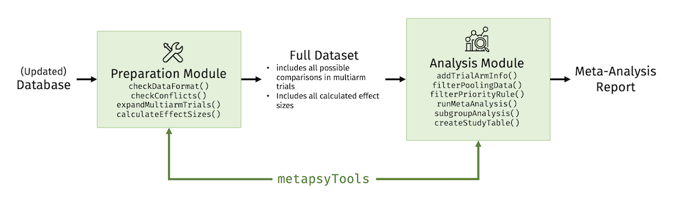
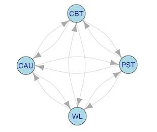
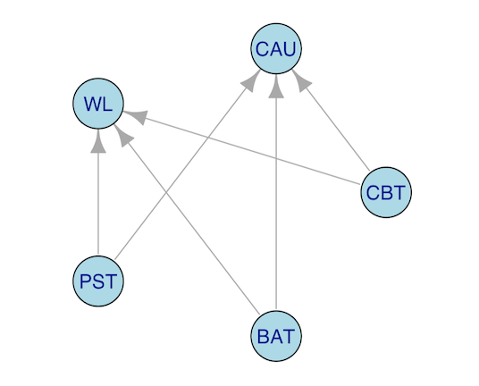
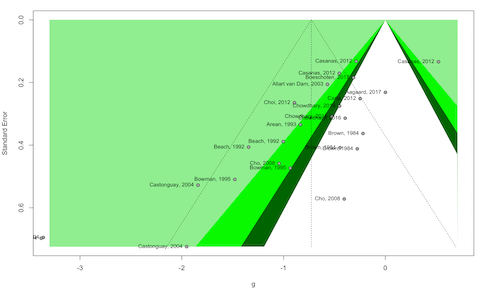
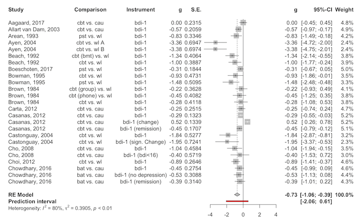
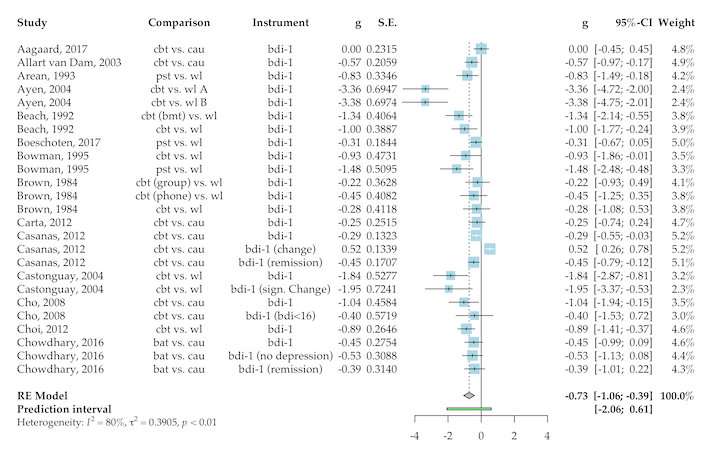
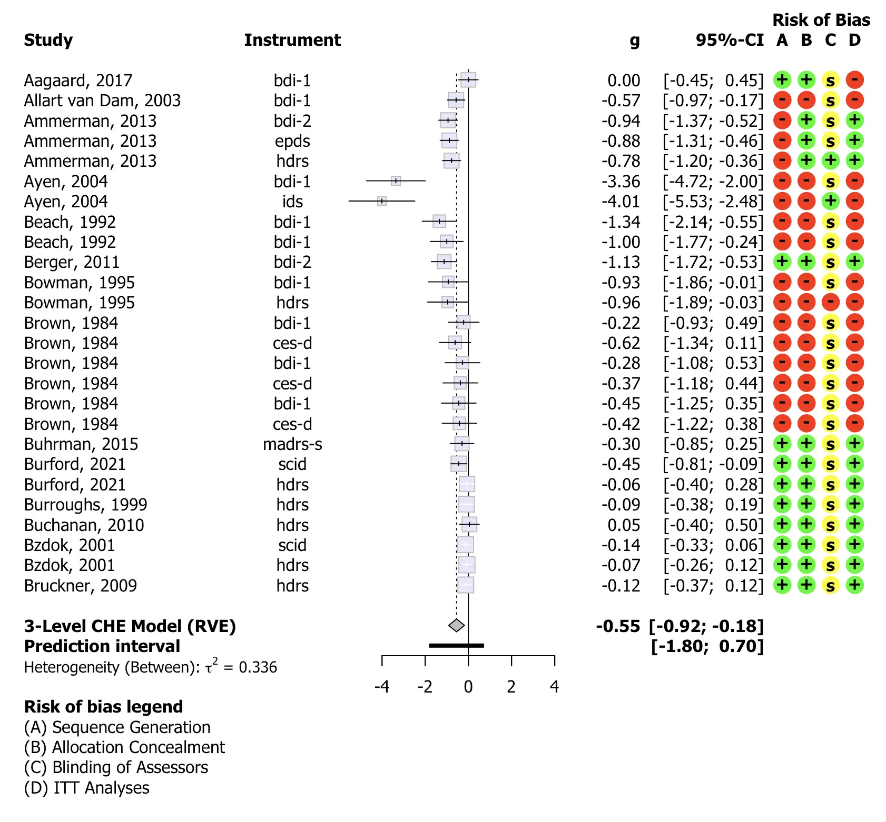
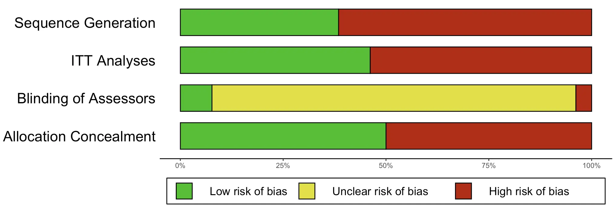

```{r, include = FALSE}
options(rmarkdown.html_vignette.check_title = FALSE)
```


**This article showcases core functionalities of the package, and how to apply them in practice.** 

<br></br>

##  Introduction

------------------------------------------------------------------------

The `metapsyTools` package is part of the [**Metapsy**](https://www.metapsy.org) project. Functions included in the package can be used to run meta-analyses of Metapsy [databases](https://docs.metapsy.org/databases/), or of databases that adhere to the same [data standard](https://docs.metapsy.org/data-preparation/format/), "out of the box" using R.

The package also contains a set of tools that can be used to prepare meta-analytic data sets based on the Metapsy data standard, and to calculate effect sizes (Hedges' $g$ and risk ratios, $RR$).

The package consists of **two modules**:

1.  A module to check the data format and calculate effect sizes for all possible study comparisons (**preparation** **module**);
2.  A module to select relevant comparisons for a specific meta-analysis, calculate the results (including subgroup, meta-regression, and publication bias analyses), and generate tables (**analysis** **module**).

The idea is to use the two modules in different contexts. For example, the **preparation** module can be used every time the database is updated to gather all information, calculate effect sizes, and bring the data into a format suitable for further analyses.

Prepared data sets that follow the [**Metapsy data standard**](https://docs.metapsy.org/data-preparation/format/) build the basis for the **analysis** module. Researchers simply have to filter out the comparisons that are relevant for the investigation, and can then use functions of the package to run a full meta-analysis, including sensitivity and subgroup analyses.

<br>

{width="685px"}

::: {style="background-color: #f1f3f5 !important; padding: 25px; padding-bottom: 15px; border-radius: 5px; color: gray; box-shadow: 0px 0px 5px;"}
<strong>Important</strong>: The preparation module requires a familiarity with the general structure of the database, as well as intermediate-level knowledge of R and the `metapsyTools` package itself, in order to diagnose (potential) issues. We advise that the preparation step (i.e. checking the data format and calculating effect sizes each time the database is updated) should be conducted by a person with some proficiency in R & data wrangling. The analysis module, on the other hand, should be usable by all researchers.
:::

<br>

The companion package of `metapsyTools` is [`metapsyData`](data.metapsy.org). Using `metapsyData`, meta-analytic databases can be automatically downloaded into your R environment. Databases retrieved using `metapsyData` can directly be analyzed using `metapsyTools`.

**If your goal is to analyze existing databases included in Metapsy, only the analysis module in `metapsyTools` is relevant to you. Click** [here](#the-analysis-module) **to navigate directly to the analysis module section.**

<br></br>

<br></br>

##  The Preparation Module

------------------------------------------------------------------------

The preparation module in `metapsyTools` allows to:

-   check if the classes of variables in the imported data are set as required, using the [checkDataFormat](https://tools.metapsy.org/reference/checkdataformat) function.
-   check for formatting conflicts which have to be resolved prior to any further steps, using the [checkConflicts](https://tools.metapsy.org/reference/checkdataformat) function.
-   calculate Hedges' $g$ and/or risk ratios ($RR$) for each comparison, provided suitable data is available, and generate a data set ready for meta-analyses, using the [calculateEffectSizes](https://tools.metapsy.org/reference/calculateeffectsizes) function.

<br></br>

### Required Data Structure

For your own convenience, it is highly advised to **strictly** follow some data formatting rules prior to importing a data set for effect size calculations. If all of these rules are followed closely, it minimizes the risk of receiving error messages, producing conflicts, etc.

A detailed description of the preferred data structure can be found in the [**Metapsy documentation**](https://docs.metapsy.org/data-preparation/format/). The `metapsyTools` package also includes a "toy" data set called [`depressionPsyCtr`](https://tools.metapsy.org/reference/depressionpsyctr), which has already been pre-formatted to follow the required data format.

To use the data preparation module (i.e. calculate effect sizes), **study design (I)** and **effect size data variables (II)** must be included in the data set.

<br>

#### Study Design Variables (I)

-   **`study`**: The study name, formatted as "last name of the first author", "year" (e.g. `"Smith, 2011"`).
-   **`condition_arm1`**: Condition in the first trial arm. The condition name is standardized to ensure comparability across trials (e.g. `cbt` for all trial arms that employed cognitive-behavioral psychotherapy).
-   **`condition_arm2`**: Condition in the second trial arm. The condition name is standardized to ensure comparability across trials (e.g. `wlc` for all trial arms that employed a waitlist control group).
-   **`multi_arm1`**: In multiarm trials, this variable provides a "specification" of the type of treatment used in the first arm. This variable is set to `NA` (missing) when the study was not a multiarm trial. For example, if a multiarm trial employed two types of CBT interventions, face-to-face and Internet-based, this variable would be set to `f2f` and `Internet`, respectively.
-   **`multi_arm2`**: In multiarm trials, this variable provides a "specification" of the type of treatment used in the second arm. This variable is set to `NA` (missing) when the study was not a multiarm trial. For example, if a multiarm trial employed two types of control groups, waitlist and placebo, this variable would be set to `wl` and `plac`, respectively.
-   **`outcome_type`**: This variable encodes the type of outcome that builds the basis of the comparison, e.g. `"response"`, `"remission"` or `"deterioration"`. This is variable is particularly relevant for dichotomous effect size data, because it indicates what the event counts refer to. The `"msd"` factor level is used for outcomes expressed in means and standard deviations.
-   **`instrument`**: This variable describes the instrument through which the relevant outcome was measured.
-   **`time`**: The measurement point at which the outcome was obtained (e.g. `post` or `follow-up`).
-   **`time_weeks`**: The measurement point at which the outcome was obtained, in weeks after randomization (set to `NA` if this information was not available).
-   **`rating`**: This variable encodes if the reported outcome was self-reported (`"self-report"`) or clinician-rated (`"clinician"`).

<br>

#### Effect Size Data Variables (II)

Each Metapsy database also contains variables in which the (raw or pre-calculated) effect size data is stored. In each row, one of the following variable groups (a) to (d) are specified, depending on the type of outcome data reported in the paper. **The rest of the variable groups will contain `NA` in that row.**


::: {style="background-color: #f1f3f5 !important; padding: 25px; padding-bottom: 15px; border-radius: 5px; color: gray; box-shadow: 0px 0px 5px;"}
When preparing the effect size data, it is very important that each row only has data provided for one variable group (as defined below), while the other variable groups are `NA` (i.e., have missing values). Otherwise, the [`calculateEffectSizes`](https://tools.metapsy.org/reference/calculateeffectsizes) function that we use later will not know which type of effect size should be calculated.
:::

<br>

**(a)** **Continuous Outcome Data**

-   **`mean_arm1`**: Mean of the outcome in the first arm at the measured time point.
-   **`mean_arm2`**: Mean of the outcome in the second arm at the measured time point.
-   **`sd_arm1`**: Standard deviation of the outcome in the first arm at the measured time point.
-   **`sd_arm2`**: Standard deviation of the outcome in the second arm at the measured time point.
-   **`n_arm1`**: Sample size in the first trial arm.
-   **`n_arm2`**: Sample size in the second trial arm.

<br>

**(b) Change Score Data**

-   **`mean_change_arm1`**: Mean score change between baseline and the measured time point in the first arm.
-   **`mean_change_arm2`**: Mean score change between baseline and the measured time point in the second arm.
-   **`sd_change_arm1`**: Standard deviation of the mean change in the first arm.
-   **`sd_change_arm2`**: Standard deviation of the mean change in the second arm.
-   **`n_change_arm1`**: Sample size in the first trial arm.
-   **`n_change_arm2`**: Sample size in the second trial arm.

<br>

**(c) Dichotomous Outcome Data (Response, Remission, Deterioration, ...)**

-   **`event_arm1`**: Number of events (responders, remission, deterioration cases) in the first trial arm.
-   **`event_arm2`**: Number of events (responders, remission, deterioration cases) in the second trial arm.
-   **`totaln_arm1`**: Sample size in the first trial arm.
-   **`totaln_arm2`**: Sample size in the second trial arm.

<br>

**(d) Pre-calculated Hedges'** $g$

-   **`precalc_g`**: The pre-calculated value of Hedges' $g$ (small-sample bias corrected standardized mean difference; [Hedges, 1981](https://journals.sagepub.com/doi/10.3102/10769986006002107)).
-   **`precalc_g_se`**: Standard error of $g$, viz. $\sqrt{V_g}$.

<br>

**(d) Pre-calculated log-risk ratio**

-   **`precalc_log_rr`**: The pre-calculated value of the log-risk ratio $\log_{e}\text{RR}$, comparing events in the first arm to events in the second arm.
-   **`precalc_log_rr_se`**: The standard error of the log-risk ratio $\log_{e}\text{RR}$, comparing events in the first arm to events in the second arm.

<br></br>

#### Additional Considerations

Metapsy databases also contain additional variables. These are used, for example, to collect subject-specific information that is not relevant for all indications. Nevertheless, there are several formatting rules that all variables/columns follow:

-   All variable names are in [`snake_case`](https://en.wikipedia.org/wiki/Snake_case?oldformat=true).
-   Variable names start with a standard letter (`_` is not allowed, `.` is only allowed for `metapsyTools` variables).
-   Variable names do not contain special characters (like \@, ğ).
-   Semicolons (`;`) are not used; neither as variable names nor as cell content.
-   Character values contain no leading/trailing white spaces.
-   Missing values are encoded using `NA`.

<br></br>

### Data Format & Conflict Check

Once the data set has been pre-structured correctly, `metapsyTools` allows you to check the required variable format and control for potential formatting conflicts.

If the formatting rules above are followed, none of the default behavior of the preparation module has to be changed. At first, one can run `checkDataFormat`. As an illustration, we will use the [`depressionPsyCtr`](https://tools.metapsy.org/reference/depressionpsyctr) data frame, a pre-installed "toy" data set which is directly available after installing `metapsyTools`.

```{r, eval=F}
# Load metapsyTools & dplyr
library(metapsyTools)
library(dplyr)

# Load preinstalled "toy" dataset
data("depressionPsyCtr")

# Check data format
depressionPsyCtr <- checkDataFormat(depressionPsyCtr)
```

    # - [OK] Data set contains all variables in 'must.contain'.
    # - [OK] 'study' has desired class character.
    # - [OK] 'condition_arm1' has desired class character.
    # [...]

We see that the function has checked the required variables and their class. If divergent, the function will also try to **convert** the variable to the desired format.

<br>

::: {style="background-color: #f1f3f5 !important; padding: 25px; padding-bottom: 15px; border-radius: 5px; color: gray; box-shadow: 0px 0px 5px;"}
<strong>Required variables for unique IDs</strong>: To function properly, the `metapsyTools` functions must be able to generate a *unique* ID for each comparison. By default, this is achieved by combining information of the `study`, `condition_arm1`, `condition_arm2`, `multi_arm1`, `multi_arm2`, `outcome_type`, `instrument`, `time`, `time_weeks`, `rating` variables. These variables are included by default in the `must.contain` argument in the `checkDataFormat` function. If all required variables are detected, an `OK` message is returned; as is the case in our example.
:::

<br>

We can also check the data for potential formatting issues, using the `checkConflicts` function.

```{r, eval=F}
depressionPsyCtr <- checkConflicts(depressionPsyCtr) 
```

``` r
# - [OK] No data format conflicts detected.
```

In our case, no data format conflicts were detected. This is because all the data were pre-structured correctly. If data conflicts exist, the output looks similar to this:

    # - [!] Data format conflicts detected!
    # ID conflicts 
    # - check if variable(s) study create(s) unique assessment point IDs 
    # - check if specification uniquely identifies all trial arms in multiarm trials 
    # --------------------
    # Abas, 2018
    # Ammerman, 2013
    # Andersson, 2005
    # [...]

ID conflicts typically occur because the information in the variables used to build the IDs (see box above) is not sufficient to create a unique ID for each comparison. Studies with non-unique IDs are subsequently printed out. The checkConflicts function also has an argument called `vars.for.id`, which can be used define (other or additional) columns to be used for ID generation. This can sometimes help to create unique IDs.

As an illustration, we now define an extended variable list to be used for our IDs in [`checkConflicts`](https://tools.metapsy.org/reference/checkconflicts):

```{r, eval=F}
# Define extended ID list 
# "target_group" is now also included
id.list <- c("study", "outcome_type",
             "instrument", "time", "time_weeks",
             "rating", "target_group")

# Use id.list as input for vars.for.id argument
checkConflicts(depressionPsyCtr,
               vars.for.id = id.list)
```

<br></br>

### Effect Size Calculation

If the data set has been pre-formatted correctly, and all ID conflicts were resolved, the [`calculateEffectSizes`](https://tools.metapsy.org/reference/calculateeffectsizes) function can be used to **calculate effect sizes** (Hedges' $g$ or risk ratios, $RR$) for all comparisons in the database.

The `calculateEffectSizes` function uses the information stored in the [effect size data variables](https://tools.metapsy.org/articles/metapsytools#effect-size-data-variables-ii) to calculate $g$ and/or $RR$, depending on what information is available. Therefore, it is very important to make sure these variables are defined correctly before running `calculateEffectSizes`.

The `calculateEffectSizes` function adds nine columns to the data set, all of which start with a dot (`.`). They are included so that meta-analysis functions in `metapsyTools` can be applied "out of the box".

-   **`.id`**: Unique identifier for a trial arm comparison/row.
-   **`.g`**: Calculated effect size (Hedges' $g$).
-   **`.g_se`**: Standard error of Hedges' $g$.
-   **`.log_rr`**: Calculated effect size ($\log_{e}\text{RR}$).
-   **`.log_rr_se`**: Standard error of $\log_{e}\text{RR}$.
-   **`.event_arm1`**: Number of events (e.g. responders) in the first trial arm.
-   **`.event_arm2`**: Number of events (e.g. responders) in the second trial arm.
-   **`.totaln_arm1`**: Total sample size in the first trial arm.
-   **`.totaln_arm2`**: Total sample size in the second trial arm.

```{r, eval=F}
data <- calculateEffectSizes(depressionPsyCtr)
```

Now, let us have a look at the calculated effect sizes ($g$ and $\log_eRR$) in a random slice of the data:

```{r, eval=F}
# Show rows 10 to 15, and variables "study", ".g", and ".log_rr"
data %>% 
  slice(10:15) %>% 
  select("study", ".g", ".log_rr")
```

    #                   study         .g    .log_rr
    # 10     Ahmadpanah, 2016  1.7788677         NA
    # 11    Alexopoulos, 2016  0.2151835 -0.2436221
    # 12    Alexopoulos, 2016 -0.2151835  0.2436221
    # 13 Allart van Dam, 2003 -0.5696379         NA
    # 14 Allart van Dam, 2003  0.5696379         NA
    # 15       Ammerman, 2013 -0.9439887         NA

We see one important detail here. When dichotomous outcome data is provided, the [`calculateEffectSizes`](https://tools.metapsy.org/reference/calculateeffectsizes) function automatically calculates both the log-risk ratio, and an estimate of $g$. Therefore, effects on remission, response, etc. are by default also included in meta-analyses based on Hedges' $g$. Please make sure to filter these effect sizes out if you do not want to have them included in your meta-analysis. The [`filterPoolingData`](https://tools.metapsy.org/reference/filterpoolingdata) function, which we will cover later, allows to do this.

<br>

#### Change Effect Size Sign

The `change.sign` argument in `calculateEffectSizes` can be used to change the sign of one or several calculated effect sizes (e.g. change the calculated effect size from $g$=0.30 to $g$=---0.30, or vice versa). This is illustrated below:

```{r, eval=F}
# Take a slice of the data for illustration
depressionPsyCtrSubset <- depressionPsyCtr %>% slice(10:15)

# Create a logical variable which, for each row,
# indicates if the sign of g should be changed
depressionPsyCtrSubset$sign_change <- c(TRUE, TRUE, TRUE, 
                                        TRUE, TRUE, FALSE)

# Calculate effect sizes while defining the variable in 
# our data in which the change sign information is stored
data.change.sign <- calculateEffectSizes(
                      depressionPsyCtrSubset,
                      change.sign = "sign_change")

# Show the relevant columns
data.change.sign %>% 
  select(study, .g, .log_rr)
```

    #                  study         .g    .log_rr
    # 1     Ahmadpanah, 2016 -1.7788677         NA
    # 2    Alexopoulos, 2016  0.2151835 -0.2436221
    # 3    Alexopoulos, 2016  0.2151835  0.2436221
    # 4 Allart van Dam, 2003  0.5696379         NA
    # 5 Allart van Dam, 2003 -0.5696379         NA
    # 6       Ammerman, 2013 -0.9439887         NA

We see that `.g` has now changed where ever `sign_change` has been set to `TRUE`. We also see that this **does not affect** the estimates of $\log_eRR$.

<br>

#### Including Switched Arms

By default, Metapsy databases will only include all unique trial arm **combinations**, not all unique **comparisons**. To show when and why this difference matters, let us consider a small example.

Imagine that we have data of a four-arm trial. Say that this trial included CBT, PST, CAU and a wait-list condition. While this trial provides 6 unique trial arm combinations[^1], the number of unique *comparisons* is higher: $\frac{n!}{(n-k)!} = \frac{4!}{2!} = 12$.

[^1]: CBT vs. PST, CBT vs. CAU, CBT vs. Waitlist, PST vs. CAU, PST vs. Waitlist, and CAU vs. Waitlist. You can also confirm this by running: `combn(c("cbt", "pst", "cau", "wl"), 2)`. Please note that not all possible combinations will be included in all Metapsy data set (e.g., the CAU-Waitlist combination in our example may typically not be included).

This is because the sign of the calculated effect size depends on which treatment serves as the *reference*. The effect of CBT vs. PST, for example, depends on which arm serves as the reference group (i.e. CBT vs. PST or PST vs. CBT). Depending on which arm is chosen (and assuming non-zero mean differences), the calculated effect size (e.g. Hedges' $g$) value will either be negative (e.g. $g$=-0.31) or positive ($g$=0.31). We see this visualized in the graph below. There are now two directed arrows for each comparison (12 in total), and each arrow reads as "is compared to":

<center>{width="200px"}</center>

To truly calculate all unique *comparisons*, we have to set the `include.switched.arms` argument to `TRUE` when running `calculateEffectSizes`.

```{r, eval=F}
data.switched.arms <- calculateEffectSizes(
                        depressionPsyCtr,
                        include.switched.arms = TRUE)

```

The resulting data frame `data` now includes all effect sizes that can theoretically be calculated (assuming that all relevant combinations were included in the original data).

<br>

::: {style="background-color: #f1f3f5 !important; padding: 25px; padding-bottom: 15px; border-radius: 5px; color: gray; box-shadow: 0px 0px 5px;"}
<strong>Should I use include.switched.arms?</strong> It is not essential to calculate all possible arm comparisons. However, having all possible comparisons in your data set is convenient, because all required comparisons pertaining to a particular research question (e.g. "how effective is PST when CBT is the reference group?") can directly be filtered out; there is typically no need for further data manipulation steps then.

The `include.switched.arms` argument can also be helpful if you want to prepare **network meta-analysis** data (which is subsequently analyzed using, e.g., the [`netmeta`](https://bookdown.org/MathiasHarrer/Doing_Meta_Analysis_in_R/netwma.html#frequentist-network-meta-analysis-in-r) package). However, this assumes that the data set already contains all unique **combinations** in multi-arm trials (e.g. all 6 combinations in the four-arm study above, not just a selection).
:::

<br>

This leads to our final data set which can be used with the **analysis module**, which will be described next.

<br></br>

<br></br>

##  The Analysis Module {#the-analysis-module}

------------------------------------------------------------------------

The analysis module in `metapsyTools` allows to run different kinds of meta-analyses based on the final data set created by the preparation module. It is designed to also be usable by researchers who were not directly involved in the preparation step, and is less demanding in terms of required background knowledge. Metapsy databases included in [**metapsyData**](https://data.metapsy.org/) can directly be used by the analysis module in `metapsyTools`.

The analysis module allows, among other things, to:

-   Filter data using strict rules, fuzzy string matching, or by implementing prioritization rules ([`filterPoolingData`](https://tools.metapsy.org/reference/filterpoolingdata) and [`filterPriorityRule`](https://tools.metapsy.org/reference/filterpriorityrule))[^2].
-   Run conventional random-effects meta-analysis models, as well as commonly reported sensitivity analyses ([`runMetaAnalysis`](https://tools.metapsy.org/reference/runmetaanalysis)).
-   Correct effect estimates for potential publication bias or small-study effects ([`correctPublicationBias`](https://tools.metapsy.org/reference/correctpublicationbias)).
-   Run subgroup analyses based on the fitted model ([`subgroupAnalysis`](https://tools.metapsy.org/reference/subgroupanalysis))
-   Create study information tables ([`createStudyTable`](https://tools.metapsy.org/reference/createstudytable)).

[^2]: These functions are technically part of the [preparation module](https://tools.metapsy.org/reference/#preparation-module), but are listed here for convenience.

<br>

### Filtering Relevant Comparisons

The `metapsyTools` package contains functions which allow to flexibly filter out comparisons that are relevant for a particular meta-analysis.

The [`filterPoolingData`](https://tools.metapsy.org/reference/filterpoolingdata) function is the main function for filtering. We simply have to provide the final data set with calculated effect sizes (see [preparation module](https://tools.metapsy.org/articles/metapsytools#the-preparation-module)), as well as one or several filtering criteria pertaining to our specific research question.

Say that we want to run a meta-analysis of all studies in which CBT was compared to wait-lists, with the BDI-I at post-test being the analyzed outcome. We can filter out the relevant comparisons like this:

```{r, eval=FALSE}
# Load the pre-installed "depressionPsyCtr" dataset
load("depressionPsyCtr")
data <- depressionPsyCtr

# Filter relevant comparisons
data %>% 
    filterPoolingData(
      condition_arm1 == "cbt",
      condition_arm2 == "wl",
      instrument == "bdi-1",
      time == "post") %>% nrow()
```

    # [1] 7

We see that $k$=7 comparisons fulfill these criteria. Note, however, that this will only select comparisons for which `condition_arm1` was *exactly* defined as `"cbt"`.

It is also possible to filter out all rows that simply *contain* a specific search term (**fuzzy matching**). For example, instead of `"cbt"`, we might want to filter out all studies that employed some type of "other" therapy format. This can be achieved by using the `Detect` function within [`filterPoolingData`](https://tools.metapsy.org/reference/filterpoolingdata):

```{r, eval=F}
data %>% 
  filterPoolingData(
    Detect(condition_arm1, "other")) %>%
  pull(condition_arm1)
  
```

    # [1] "other psy" "other ctr" "other ctr" "other ctr" "other ctr" "other ctr" 
    # [7] "other ctr" "other ctr" "other psy"

We can create even more complex filters. Say that we want to examine the effect, as measured by the BDI-I at post-test, of CBT, PST, and BAT compared to *either* CAU or wait-lists. We can visualize this with a graph again:

```{r, eval=F, echo=F}
library(igraph)
vertex = c("CBT", "CAU", "CBT", "WL", "PST", "CAU", "PST", "WL", "BAT", "CAU", "BAT", "WL")
g1 <- graph(edges=vertex, directed=TRUE) 
plot(g1, vertex.size = 35, vertex.color = "gray",
     vertex.label.family="Helvetica", layout=layout.circle)
```

<center>{width="200px"}</center>

We can use the OR-Operator `|` within `filterPoolingData` for such filter types. Again, we use the `Detect` function to allow for fuzzy matching:

```{r, eval=F}
data %>% 
  filterPoolingData(
    Detect(condition_arm1, "cbt|pst|bat"),
    Detect(condition_arm2, "cau|wl"),
    instrument == "bdi-1",
    time == "post") %>% nrow()
```

    # [1] 11

<br>

Lastly, one can also filter data according to a specified **priority rule**, using the [`filterPriorityRule`](https://tools.metapsy.org/reference/filterpriorityrule) function. This is particularly helpful to select instruments. Say, for example, that we ordered certain instruments based on their known reliability. Now, for each study, we only want to select the comparison in which the most reliable instrument was used. It is possible that, for some studies, all used instruments are relatively unreliable. However, given our priority rule, we can still extract the comparison with a *relatively* high reliability, and discard all the other measurements within one study that are even less reliable.

Assume that our priority rule for the employed instrument is `"hdrs"` (priority 1), `"bdi-2"` (priority 2), `"phq-9"` (priority 3) and `"bdi-1"` (priority 4). We can implement the rule like this:

```{r, eval=F}
data %>% 
  
  # First, filter all other relevant characteristics
  filterPoolingData(
    Detect(condition_arm1, "cbt|pst|bat"),
    Detect(condition_arm2, "cau|wl"),
    time == "post") %>% 
  
  # Now, implement the priority rule for the outcome instrument
  filterPriorityRule(
    instrument = c("hdrs", "bdi-2", 
                   "phq-9", "bdi-1")) %>% 
  
  # Show number of entries
  nrow()
```

    # [1] 20

<br>

### Pooling Effects

After all relevant rows have been filtered out, we can start to pool the effect sizes. The [`runMetaAnalysis`](https://tools.metapsy.org/reference/runmetaanalysis) function serves as a wrapper for several commonly used meta-analytic approaches, and, by default, applies them all at once to our data:

-   `"overall"`. Runs a generic inverse-variance (random-effects) model. All included effect sizes are treated as independent. If raw event data is available in the `event_arm1`, `event_arm2`, `totaln_arm1`, `totaln_arm2` columns (see [Effect Size Calculation]), the Mantel-Haenszel method (Greenland & Robins, [1985](https://www.jstor.org/stable/2530643)) is used to pool effects. Please note that assumptions of this model are violated whenever a study contributes more than one effect sizes (since these effect sizes are assumed to be correlated). In this case, results of the `"combined"` and `"threelevel"`/`"threelevel.che"` models should be reported instead.
-   `"combined"`. Aggregates all effect sizes within one study before calculating the overall effect. This ensures that all effect sizes are independent (i.e., unit-of-analysis error & double-counting is avoided). To combine the effects, one has to assume a **correlation** of effect sizes within studies, empirical estimates of which are typically not available. By default, `runMetaAnalysis` assumes that $\rho$=0.6.
-   `"lowest.highest"`. Runs a meta-analysis, but with only (i) the lowest and (ii) highest effect size within each study included.
-   `"outlier"`. Runs a meta-analysis without statistical outliers (i.e. effect sizes for which the confidence interval does not overlap with the confidence interval of the overall effect).
-   `"influence"`. Runs a meta-analysis without influential cases, as defined using the influence diagnostics in Viechtbauer & Cheung ([2010](https://onlinelibrary.wiley.com/doi/10.1002/jrsm.11)). See also the [`InfluenceAnalysis`](https://dmetar.protectlab.org/reference/influenceanalysis) function in [`dmetar`](https://dmetar.protectlab.org/), and Harrer et al. (2022, [chap. 5.4.2](https://bookdown.org/MathiasHarrer/Doing_Meta_Analysis_in_R/heterogeneity.html#influence-analysis)).
-   `"rob"`. Runs a meta-analysis with only low-RoB studies included. By default, only studies with a value `> 2` in the `rob` variable are considered for this analysis.
-   `"threelevel"`. Runs a multilevel (three-level) meta-analysis model, with effect sizes nested in studies (Harrer et al., 2022, [chap. 10](https://bookdown.org/MathiasHarrer/Doing_Meta_Analysis_in_R/multilevel-ma.html)).
-   `"threelevel.che"`. Runs a multilevel (three-level) "correlated and hierarchical effects" (CHE) meta-analysis model. In this model, effect sizes are nested in studies, and effects within studies are assumed to be correlated (Pustejovsky & Tipton, [2022](https://link.springer.com/article/10.1007/s11121-021-01246-3); by default, it is assumed that $\rho$=0.6). This will typically be a plausible modeling assumption in most real-world use cases. In most scenarios, the `"threelevel.che"` model can be seen as a better (and therefore preferable) approximation of the data structure at hand, compared to the simpler `"threelevel"` model.

To illustrate how the function works, we first select a subset of our "toy" `depressionPsyCtr` data.

```{r, eval=F}
# Only select data comparing CBT to waitlists and CAU
depressionPsyCtr %>% 
  filterPoolingData(
    condition_arm1 == "cbt",
    Detect(condition_arm2, "wl|cau")
  ) -> ma.data
```

Then, we plug the resulting `ma.data` data set into the `runMetaAnalysis` function:

```{r, eval=F}
res <- runMetaAnalysis(ma.data)
```

    # - Running meta-analyses...
    # - [OK] Using Hedges' g as effect size metric... 
    # - [OK] Calculating overall effect size... DONE
    # - [OK] Calculating effect size using only lowest effect... DONE
    # - [OK] Calculating effect size using only highest effect... DONE
    # - [OK] Calculating effect size using combined effects (rho=0.6; arm-wise)... DONE
    # - [OK] Calculating effect size with outliers removed... DONE
    # - [OK] Calculating effect size with influential cases removed... DONE
    # - [OK] Calculating effect size using only low RoB information... DONE
    # - [OK] Calculating effect size using three-level MA model... DONE
    # - [OK] Robust variance estimation (RVE) used for three-level MA model... DONE
    # - [OK] Calculating effect size using three-level CHE model (rho=0.6)... DONE
    # - [OK] Robust variance estimation (RVE) used for three-level CHE model... DONE
    # - [OK] Done!

As we can see, while running, the `runMetaAnalysis` function provides us with a few messages that allow to trace if all models have been fitted successfully. When there are problems during the calculation, the `runMetaAnalysis` function will print a warning.

```{r, eval=FALSE}
# This tells the function to only consider studies with a rob score 
# above 4 in the "low risk of bias" sensitivity analysis
runMetaAnalysis(ma.data, low.rob.filter = "rob > 4")
```

    # [...]
    # - [!] No low risk of bias studies detected! Switching to 'general'... DONE
    # [...]

We can inspect the results by calling the created `res` object in the console.

```{r, eval=F}
res
```

    # Model results ------------------------------------------------ 
    # Model                       k     g g.ci           p         i2 i2.ci          prediction.ci   nnt
    # Overall                    26 -0.57 [-0.85; -0.28] <0.001  76.4 [65.65; 83.76] [-1.57; 0.43]  5.22
    # Combined                   17 -0.54 [-0.89; -0.18] 0.005   77.1 [63.64; 85.57] [-1.64; 0.57]  5.56
    # One ES/study (lowest)      14 -0.57 [-1; -0.13]    0.015   79.8 [66.82; 87.65] [-1.78; 0.64]  5.22
    # One ES/study (highest)     14 -0.47 [-0.84; -0.11] 0.015   73.9 [55.75; 84.62] [-1.45; 0.5]   6.41
    # Outliers removed           23 -0.46 [-0.63; -0.29] <0.001  61.6 [39.55; 75.55] [-1.11; 0.19]  6.64
    # Influence Analysis         24 -0.43 [-0.6; -0.27]  <0.001  63.9 [44.18; 76.66] [-1.08; 0.22]  7.08
    # Only rob > 2               13 -0.34 [-0.58; -0.11] 0.008   73.4 [53.91; 84.71] [-1.1; 0.41]   9.12
    # Three-Level Model          26 -0.61 [-1.05; -0.17] 0.011   92.1 -              [-2.17; 0.96]  4.81
    # Three-Level Model (CHE)    26 -0.55 [-0.92; -0.18] 0.007   88   -              [-1.8; 0.7]    5.42
    # 
    # Variance components (three-level model) ---------------------- 
    # Source           tau2    i2
    # Between Studies 0.536  92.1
    # Within Studies  0       0  
    # Total           0.536  92.1
    # 
    # Variance components (three-level CHE model) ------------------ 
    # Source           tau2    i2
    # Between Studies 0.336  87.2
    # Within Studies  0.003   0.8
    # Total           0.339  88  

By default, an **HTML table** should pop up along with the console output. These pre-formatted HTML results tables can easily be transferred to, for example, MS Word using copy and paste. To disable this feature, we have to specify `html=FALSE` inside the function call.

<iframe src="https://tools.metapsy.org/figures/tbl.html" style="width: 100%; height: 745px;">

</iframe>

<br>

Using the `summary` method, details of the analysis settings can be printed. This function also returns recommended citations for the applied methods and/or packages. Furthermore, it creates a **summary forest plot** in which all pooled effects are displayed.

```{r, eval=F}
summary(res)
```

    ## Analysis settings ---------------------------------------------------------- 
    ## 
    ## ✓ [Overall] Random effects model assumed. 
    ## ✓ [Overall] Heterogeneity variance (tau2) calculated using restricted maximum-likelihood estimator. 
    ## ✓ [Overall] Test statistic and CI of the pooled effect calculated using the Knapp-Hartung adjustment. 
    ## ✓ [Outliers removed] ES removed as outliers if the CI did not overlap with pooled effect CI. 
    ## ✓ [Influence Analysis] Influential cases determined using diagnostics of Viechtbauer and Cheung (2010). 
    ## [...]
    ## 
    ## 
    ## Cite the following packages/methods: ---------------------------------------
    ## 
    ##  - {meta}: Balduzzi S, Rücker G, Schwarzer G (2019),
    ##           How to perform a meta-analysis with R: a practical tutorial,
    ##           Evidence-Based Mental Health; 22: 153-160. 
    ##  - {metafor}: Viechtbauer, W. (2010). Conducting meta-analyses in R
    ##           with the metafor package. Journal of Statistical Software, 36(3), 1-48.
    ##           https://doi.org/10.18637/jss.v036.i03. 
    ##  [...]


<br>

#### Additional Arguments

The `runMetaAnalysis` function allows to tweak many, many details of the specific meta-analysis models (run `?runMetaAnalysis` to see the entire documentation). The most important arguments one may want to specify are:

-   `es.measure`. By default, the function conducts analyses using the Hedges $g$ values stored in the data set. To conduct analyses using dichotomous outcome data (i.e. response, remission, etc.), one has to set this argument to `"RR"`.
-   `es.type`. By default, analyses are conducted using the `"precalculated"` effect sizes stored in the prepared data set. For risk ratios, one can alternatively set this argument to `"raw"`, which means that the "raw" event counts are used for computations (instead of the pre-calculated log-risk ratio and its standard error). This is typically preferable, but may not be possible if this information could not be extracted from all primary studies.
-   `method.tau`. This argument controls the method to be used for estimating the between-study heterogeneity variance $\tau^2$. The default is `"REML"` (restricted maximum likelihood), but other options such as the DerSimonian-Laird estimator (`"DL"`) are also available (see the [`runMetaAnalysis`](https://tools.metapsy.org/reference/runmetaanalysis) function documentation for more details). Note that three-level meta-analysis models can only be fitted using (restricted) maximum likelihood.
-   `nnt.cer`. The `runMetaAnalysis` function uses the method by Furukawa and Leucht ([2011](https://journals.plos.org/plosone/article?id=10.1371/journal.pone.0019070)) to calculate the Number Needed to Treat (NNT) for each pooled effect size. This method needs an estimate of the control group event rate (CER). By default, `nnt.cer = 0.2` is used, but you can set this to another value if desired.
-   `rho.within.study`. To combine effect sizes on a study level before pooling (`"combined"` model), one has to assume a within-study correlation of effects. By default, `rho.within.study = 0.6` is assumed, but this value can and should be changed based on better approximations. This value also controls the assumed within-study correlation in the multilevel CHE model (`"theelevel.che"`).
-   `low.rob.filter`. By default, the function uses all comparisons for which the risk of bias rating in the `rob` variable has a value greater `2` (`low.rob.filter = "rob > 2"`). If your risk of bias rating is in another variable, or if another threshold should be used, you can change this argument accordingly.

Here is an example of a `runMetaAnalysis` call with non-default settings:

```{r, eval=FALSE}
runMetaAnalysis(ma.data,
                es.measure = "RR",
                es.type = "raw",
                method.tau = "DL",
                nnt.cer = 0.4,
                rho.within.study = 0.8)
```

Also note that for the `"combined"` model, by default, effect sizes of multi-arm trials will be aggregated on an **arms** **level**. If, for example, a study included a CBT, Internet-based CBT, and wait-list arm (where wait-list is the reference condition), two separate aggregated effects will be calculated: one for CBT vs. wait-list, and one for Internet-based CBT vs. wait-list.

From a statistical perspective, it is typically preferable to aggregate on a **study level** instead[^3] (in our example, this would lead to one aggregated effect for CBT/Internet-based CBT combined vs. wait-list), although the aggregated effect sizes may then be more difficult to interpret from a clinical perspective.

[^3]: This is because, if effect sizes are aggregated on an arms level, the resulting effect size estimates of multi-arm studies are correlated, while the meta-analytic model assumes that they are independent.

To combine effect sizes on a study level instead, we can set the `which.combine` argument to `"studies"`.


```{r, eval=F}
runMetaAnalysis(ma.data, which.combine = "studies")
```

<br>

#### Confidence Intervals for Three-Level Model $\tau^2$ and $I^2$ Values

Please note that, by default, no confidence intervals are printed for the $I^2$ value of the `"threelevel"` and `"threelevel.che"` model (the same is also the case for the $G^2$ value, the equivalent of $I^2$ in limit meta-analyses; see [Publication Bias] section)[^4]. This is because there are two heterogeneity variances in three-level models: the "conventional" between-study heterogeneity variance $\tau^2_{(1)}$ and the heterogeneity variance within studies, $\tau^2_{(2)}$. This means that there are also two $I^2$ values, one within studies, and one for the between-study heterogeneity. Established closed-form or iterative solutions (such as the $Q$-Profile method; Viechtbauer, [2007](https://pubmed.ncbi.nlm.nih.gov/16463355/)) are not directly applicable here, which means that confidence intervals cannot be calculated that easily.

[^4]: The $G^2$ statistic ([Rücker et al., 2011](https://academic.oup.com/biostatistics/article/12/1/122/391113)) quanitifies the percentage of between-study heterogeneity that remains after small-study effects have been accounted for (in `metapsyTools`, $G^2$ is printed as $I^2$ ).

In `metapsyTools`, one can resort to the **parametric bootstrap** (van den Noortgate & Onghena, [2005](https://link.springer.com/content/pdf/10.3758/BF03206394.pdf)) to obtain approximate confidence intervals around the $\tau^2$ and $I^2$ values. Bootstrapping is performed when the `i2.ci.boot` argument is set to `TRUE`. By default, $n$=5000 bootstrap samples are drawn, which should be seen as the absolute lower limit; more replications are preferable and can be specified via the `nsim.boot` argument.

Please note that the **bootstrapping is computationally expensive**, which means that it can take up to an hour and longer until final results are obtained. During the bootstrapping procedure, the function prints a progress update so that users get an indication of how long the function (still) has to run.

```{r, eval=FALSE}
res.boot <- runMetaAnalysis(ma.data,
                            i2.ci.boot = TRUE,
                            nsim.boot = 500)
res.boot
```

    # 1% completed | 2% completed | 3% completed ...

Confidence intervals around $I^2$ and the $\tau^2$ will then be printed out along with the usual results.

    # [...]
    # Variance components (three-level model) ---------------------- 
    # Source           tau2 tau2.ci           i2 i2.ci         
    # Between Studies 0.536 [0.178; 1.092]  92.1 [74.29; 95.72]
    # Within Studies  0     [0; 0.055]       0   [0; 10.43]    
    # Total           0.536 [0.182; 1.107]  92.1 [79.83; 96.01]
    # 
    # Variance components (three-level CHE model) ------------------ 
    # Source           tau2 tau2.ci           i2 i2.ci         
    # Between Studies 0.336 [0.068; 0.667]  87.2 [56.65; 92.9] 
    # Within Studies  0.003 [0; 0.03]        0.8 [0; 10.31]    
    # Total           0.339 [0.079; 0.681]  88   [63.17; 93.67]

When `runMetaAnalysis` was run with `i2.ci.boot` set to `TRUE`, the $I^2$ (or, more correctly, $G^2$) value of the **limit meta-analysis** will also be calculated using parametric bootstraping, provided that `correctPublicationBias` is called afterwards (see [publication bias](https://tools.metapsy.org/articles/metapsytools#publication-bias) section).

<br>

#### **Complex Variance-Covariance Approximation**

The `vcov` argument in `runMetaAnalysis`controls if the effect size dependencies within the data should be approximated using a `"simple"` (default) or more `"complex"` (but potentially more accurate) method. This argument is only relevant for the `"combined"` and `"threelevel.che"` models. The default "simple" method constructs variance-covariance matrices $\Sigma_k$ for each study using a constant sampling correlation $\rho$ (defined by `rho.within.study`), which is identical across all studies, outcomes, and time points. This simplifying assumption is part of the formulation of the CHE model originally provided by Pustejovsky and Tipton ([2022](https://link.springer.com/article/10.1007/s11121-021-01246-3)).

Naturally, employing a common value of $\rho$ across all studies may not be reasonable in some analyses, and other information may be available to better approximate the effect size dependencies in the collected data. Setting `vcov` to `"complex"` allows to assume that correlations between effect sizes may differ conditional on the type of dependency. This means that the variance-covariance matrix $\Sigma_k$ of some study $k$ is approximated by an unstructured matrix with varying $\rho_{ij}$.

Put simply, this method allows to account for the fact that there can be **various types of effect size dependencies** (e.g. effect sizes are dependent because different instruments were used on the same sample; or they are dependent because effects of two different intervention groups were compared to the same control group in a multi-arm trial, and so on) and that, therefore, the **magnitude of the correlation** also **differs**.

Setting `vcov = "complex"` allows to additionally incorporate assumed correlations specific to multiple testing over time (e.g. correlations between effects at post-test and long-term follow-up). The value provided in `phi.within.study` represents the **(auto-)correlation** coefficient $\phi$, which serves as a rough estimate of the re-test correlation after 1 week. This allows to model the gradual decrease in correlation between measurements over time.

Furthermore, it is possible to calculate a correlation coefficient $\rho_w$ for **multi-arm trials**, which is directly proportional to the size of each individual trial arm. When all trial arms have the same size, meaning that each arm's weight $w$ is identical, $\rho_w$ is known to be 0.5. Multiarm weights $w$ (and thus $\rho_w$) can be derived if the `w1.var` and `w2.var` variables, containing the sample size of each study arm, are available.

Using the complex approximation method increases the risk that at least one studies' $\Sigma_k$ matrix is not **positive definite**. In this case, the function automatically switches back to the constant sampling correlation approximation.

If the supplied data set format strictly follows the [**Metapsy data standard**](https://docs.metapsy.org/data-preparation/format/), it is possible to set `vcov` to `"complex"` without any further preparation steps. The function will then inform us if the complex variance-covariance approximation was not possible, meaning that the function automatically reverted to the standard `"simple"` approach.

```{r, eval=F}
runMetaAnalysis(ma.data,
                vcov = "complex")
```

If you want to use the complex variance-covariance matrix approximation feature, it is advised to make sure that the data set contains the following columns:

-   `"n_arm1"` and `"n_arm2"`: sample sizes in the two compared groups.

-   `"time_weeks"`: post-randomization time point at which the measurement was made (in weeks).

For a correctly preformatted dataset, users are referred to the [`depressionPsyCtr`](https://tools.metapsy.org/reference/depressionpsyctr) "toy" dataset.

<br>

#### Internal Objects

It is important to note that `runMetaAnalysis` is a **wrapper** function. It provides a common interface to run several meta-analysis models, while the models themselves are fitted internally by other packages. In particular, we use functionality provided by the `meta` (Balduzzi, Rücker & Schwarzer, [2019](https://www.doi.org/10.1136/ebmental-2019-300117)), [`metafor`](https://wviechtb.github.io/metafor/index.html) (Viechtbauer, [2010](https://doi.org/10.18637/jss.v036.i03)), and [`dmetar`](http://dmetar.protectlab.org) (Harrer, Cuijpers, Furukawa & Ebert, 2019) packages.

When returning the results, `runMetaAnalysis` saves all fitted models inside the returned object. Depending on their type, these **internal meta-analysis models** work just like regular `meta` or `metafor` models, which means that all functionality developed for them is also available.

It is also possible to directly extract each calculated model from the `runMetaAnalysis` results object. Each of these models are identical to the ones one would receive by running [`metagen`](https://bookdown.org/MathiasHarrer/Doing_Meta_Analysis_in_R/pooling-es.html#pre-calculated-es), [`metabin`](https://bookdown.org/MathiasHarrer/Doing_Meta_Analysis_in_R/pooling-es.html#ppoolbin), or [`rma.mv`](https://bookdown.org/MathiasHarrer/Doing_Meta_Analysis_in_R/multilevel-ma.html#multilevel-R) directly.

```{r, eval=FALSE}
res$model.overall         # "overall" model (metagen/metabin)
res$model.combined        # "combined" model (metagen/metabin)
res$model.lowest          # lowest effect size/study only model (metagen/metabin)
res$model.highest         # highest effect size/study only model (metagen/metabin)
res$model.outliers        # outliers removed model (metagen/metabin)
res$model.influence       # influential cases removed model (metagen/metabin)
res$model.rob             # low RoB model (metagen/metabin)
res$model.threelevel      # three-level model
res$model.threelevel.che  # three-level CHE model
```

This means that **any kind of operation** available for `metagen` or `rma` models **is also available for the models created by `runMetaAnalysis`**. For example, we can generate a funnel plot for our "overall" model like this:

```{r, eval=FALSE}
library(meta)

# model.overall is a "meta" model, so we can directly
# Apply the funnel function included in meta
funnel(res$model.overall, 
       studlab = TRUE, 
       contour = c(0.9, 0.95, 0.99),
       col.contour = c("darkgreen", "green", "lightgreen"))
```

<center>{width="400px"}</center>

<br>

This feature can also be used to run, for example, **Egger's regression test**, using functions already included in `meta` and `dmetar`:

```{r, eval=F}
# Egger's regression test applied to the "overall" model:
library(dmetar)
eggers.test(res$model.overall)
```

    # Eggers' test of the intercept 
    # ============================= 
    # 
    #  intercept        95% CI      t           p
    #     -2.814 -3.97 - -1.66 -4.785 7.17608e-05
    # 
    # Eggers' test indicates the presence of funnel plot asymmetry. 

For an overview of all available functionality, you can consult the specific documentation entry for each meta-analysis model type:

-   `"overall"`, `"combined"`, `"lowest"`, `"highest"`, `"outliers"`, `"influence"`, `"rob"`: run `?metagen` in the console (if effect size if $g$, or if if effect size is $RR$ and `es.type` is `"precalculated"`); otherwise, run `?metabin`.

-   `"threelevel"` and `"threelevel.che"`: run `?rma.mv` in the console. The [methods](https://wviechtb.github.io/metafor/reference/rma.mv.html#methods-1) section in this documentation entry is particularly relevant, since it shows functions that can be applied to this model type (so-called S3 methods).

<br>

#### Forest Plots

It is also possible to generate **forest plots** of all the calculated models. We only have to plug the results object into `plot`, and specify the name of the model for which the forest plot should be retrieved:

```{r, eval=F}
plot(res, "overall")        # Overall model (ES assumed independent)
plot(res, "combined")       # ES combined within studies before pooling
plot(res, "lowest.highest") # Lowest and highest ES removed (creates 2 plots)
plot(res, "outliers")       # Outliers-removed model
plot(res, "influence")      # Influential cases-removed model
plot(res, "threelevel")     # Three-level model
plot(res, "threelevel.che") # Three-level CHE model
```

This is what the `"overall"` model forest plot looks like, for example:

```{r, eval = F}
plot(res, "overall")
```

<center>{width="400px"}</center>

Note that the `plot` function is simply a wrapper for the `forest.meta` function in the `meta` package. Therefore, all the advanced [styling options](https://bookdown.org/MathiasHarrer/Doing_Meta_Analysis_in_R/forest.html) are also available using extra arguments.

```{r, eval = F}
plot(res, "overall", 
     col.predict = "lightgreen", 
     col.square = "gray",
     fontfamily = "Palatino")
```

<center>{width="400px"}</center>

It is also possible to generate [Baujat](https://bookdown.org/MathiasHarrer/Doing_Meta_Analysis_in_R/heterogeneity.html#baujat) and [Leave-One-Out Plots](https://bookdown.org/MathiasHarrer/Doing_Meta_Analysis_in_R/heterogeneity.html#loo-ma) (not displayed here).

```{r, eval = F}
plot(res, "baujat")
plot(res, "loo-es")
plot(res, "loo-i2")
```

<br>

#### Replacement Functions

Once a model has been fitted using `runMetaAnalysis`, **replacement functions** are defined for each function argument. This allows to quickly tweak one or more analysis settings, which are implemented once the `rerun` function is called.

If, for example, we want to check the results using a different estimator of $\tau^2$, and a different CER to calculate the number needed to treat, leaving all other settings the same, we can run:

```{r, eval=F}
method.tau(res) <- "PM"
nnt.cer(res) <- 0.7
```

Then, we have to call the `rerun` function:

```{r, eval=F}
rerun(res)
```

A list of all available setting replacement functions is provided [here](https://tools.metapsy.org/reference/replacement-functions). Replacement functions may be particularly helpful for **sensitivity analyses**.

<br></br>

### Publication Bias

It is also possible to correct effect size estimates for potential publication bias and/or small-study effects using the [`correctPublicationBias`](https://tools.metapsy.org/reference/correctpublicationbias) function. This will apply three correction methods at the same time, providing a range of (more or less) plausible corrected values. Using the `which.run` argument, we can apply these methods to a specific model we fitted previously.[^5] Here, we select the `"combined"` analysis.

[^5]: By default, `correctPublicationBias` uses the first model defined via `which.run`\
    in `runMetaAnalysis` (typically, the `"overall"` model). Other possible values are`"overall"`, `"combined"`, `"lowest"`, `"highest"`, `"outliers"`, `"influence"` and `"rob"`. Currently, three-level models are not supported in `correctPublicationBias`.

```{r, eval=FALSE}
correctPublicationBias(res, which.run = "combined")
```

    # [...]
    # Publication bias correction ('combined' model) ----------------------- 
    # Model                    k     g g.ci           p         i2 i2.ci          prediction.ci   nnt
    # Trim-and-fill method    24 -0.16 [-0.62; 0.31]  0.490   85.4 [79.41; 89.61] [-2.16; 1.85] 24.4 
    # Limit meta-analysis     17  0.1  [-0.32; 0.52]  0.649   95.1 -              [-1.05; 1.25] 35.4 
    # Selection model         17 -0.87 [-1.38; -0.36] <0.001  85.7 [64.72; 94.57] [-1.98; 0.24]  6.38
    # [...]

The reason why three publication bias methods are applied at the same time is because all publication bias methods are based on (to some extent) **untestable** **assumptions**, and these assumption differ between methods:

-   The **trim-and-fill** method is included mostly as a "legacy" method, given its popularity in the last decades. This method is also frequently requested by reviewers. However, it has been found that this method does not perform well as a way to correct for publication bias, especially when the between-study heterogeneity is high. The trim-and-fill method assumes that publication bias results in funnel plot asymmetry, and provides an algorithm that imputes studies so that this asymmetry is removed, after which the results are re-estimated.

-   The **limit meta-analysis** method assumes that publication bias manifests itself in so-called small-study effects (i.e., it assumes that small studies with high standard errors are more likely to be affected by publication bias). It calculates the expected ("shrunken") pooled effect as the standard error $\epsilon_k$ goes to zero, while accounting for between-study heterogeneity. Importantly, this methods controls for small-study effects only, which can be associated with publication bias, but does not have to.

-   Lastly, a **step function selection model** is calculated, which allows to account for the possibility that results are more or less likely to get published depending on their $P$ value. By default, the `selmodel.steps` argument is set to 0.05, which means that we assume that results with $p$\<0.1 are more likely to get published. It is also possible to define more than one selection threshold, e.g. by setting `selmodel.steps` to `c(0.025, 0.05)`.

For further details, see Harrer, Cuijpers, Furukawa & Ebert (2022, chap. [9.3](https://bookdown.org/MathiasHarrer/Doing_Meta_Analysis_in_R/pub-bias.html#pub-bias-which-method)).

The `correctPublicationBias` function also allows to provide additional arguments that will be applied if they match the ones defined in the [`trimfill`](https://rdrr.io/cran/meta/man/trimfill.html) and [`limitmeta`](https://rdrr.io/cran/metasens/man/limitmeta.html) functions in `meta` and `metasens` (Schwarzer, Carpenter & Rücker, [2022](https://CRAN.R-project.org/package=metasens)), respectively. You can find an example below:

```{r, eval=FALSE}
correctPublicationBias(
  
              res, which.run = "combined",
              
              # Use the R-type estimator to trim & fill
              type = "R",
              
              # Use a random-effects model without bias parameter
              # to shrink effects in the limi meta-analysis
              method.adjust = "mulim") 
```

<br>

### Subgroup Analysis

The `subgroupAnalysis` function can be used to perform subgroup analyses. Every column included in the data set initially supplied to `runMetaAnalysis` can be used as a subgroup variable.

For example, we might want to check if effects differ by country (`country`) or intervention type (`condition_arm1`):

```{r, eval=F}
sg <- subgroupAnalysis(res, country, condition_arm2)
sg
```

    # Subgroup analysis results ---------------------- 
    # variable       group n.comp     g g.ci              i2 i2.ci        nnt   p    
    # country        3         13 -0.61 [-1.3; 0.07]    81.5 [69.5; 88.8] 4.80  0.666
    # .              1         13 -0.76 [-0.93; -0.58]   0   [0; 56.6]    3.74  .    
    # condition_arm2 cau       12 -0.32 [-0.54; -0.09]  71.9 [49.6; 84.3] 9.90  0.025
    # .              wl        14 -0.96 [-1.54; -0.38]  70.6 [49.4; 83]   2.88  .  

By default, an HTML table should also pop up. The `p` column to the right represents the significance of the overall subgroup effect (there is, for example, no significant moderator effect of `country`).

It is also possible to conduct subgroup analyses using another model, say, the three-level model. We only have to specify `.which.run`:

```{r, eval=F}
sg <- subgroupAnalysis(res, 
                       country, condition_arm2,
                       .which.run = "threelevel")
```

When the number of studies in subgroups are small, it is sensible to use a **common estimate** of the between-study heterogeneity variance $\tau^2$ (in lieu of subgroup-specific estimates). This can be done by setting the `.tau.common` argument to `TRUE` in the function:

```{r, eval=FALSE}
sg <- subgroupAnalysis(res, 
                       country, condition_arm2,
                       .which.run = "combined",
                       .tau.common = TRUE)
```

<br>

### Meta-Regression

Since the `runMetaAnalysis` function saves all fitted models internally, it is also possible to extract each of them individually to do further computations. Say, for example, that we want to perform multiple meta-regression using our `threelevel` model. We want to use the risk of bias rating, as well as the scaled study year as predictors. This can be achieved by extracting the model to be analyzed using the `$` operator, and then using `metaRegression` to fit the model.

```{r, eval=F}
metaRegression(res$model.threelevel, 
               ~ scale(as.numeric(rob)) + scale(year))
```

    # Multivariate Meta-Analysis Model (k = 26; method: REML)
    # 
    # Variance Components:
    # 
    #             estim    sqrt  nlvls  fixed       factor 
    # sigma^2.1  0.3821  0.6181     14     no        study 
    # sigma^2.2  0.0000  0.0000     26     no  study/es.id 
    # 
    # Test for Residual Heterogeneity:
    # QE(df = 23) = 64.6042, p-val < .0001
    # 
    # Test of Moderators (coefficients 2:3):
    # F(df1 = 2, df2 = 23) = 3.0051, p-val = 0.0693
    # 
    # Model Results:
    # 
    #                         estimate      se     tval  df    pval    ci.lb    ci.ub     
    # intrcpt                  -0.6999  0.1923  -3.6394  23  0.0014  -1.0978  -0.3021  ** 
    # scale(as.numeric(rob))    0.5538  0.2364   2.3428  23  0.0282   0.0648   1.0428   * 
    # scale(year)              -0.2656  0.2827  -0.9395  23  0.3572  -0.8503   0.3192     
    # 
    # ---
    # Signif. codes:  0 ‘***’ 0.001 ‘**’ 0.01 ‘*’ 0.05 ‘.’ 0.1 ‘ ’ 1

Please note that, to be available in `metaRegression`, is is necessary that the moderator variable(s) are already included in the data set that we originally used to call `runMetaAnalysis`.

<br></br>

### Risk of Bias

Databases formatted using the [Metapsy data standard](https://docs.metapsy.org/data-preparation/format/) will typically also contain risk of bias ratings for each included study. The `metapsyTools` package also includes some functionality to include and display this information during the analysis.

To include risk of bias data, the `data.rob` argument has to be specified when running `runMetaAnalysis`. In particular, we need to first create and then provide a list element with all the specifications. A documentation on how to specify this list element is provided [here](https://tools.metapsy.org/reference/runmetaanalysis#risk-of-bias-data). 

```{r, eval=FALSE}
# Define ROB data to be added to the models
robData = list(
  domains = c("sg", "ac", "ba", "itt"),
  domain.names = c("Sequence Generation", 
                   "Allocation Concealment", 
                   "Blinding of Assessors", 
                   "ITT Analyses"),
  categories = c("0", "1", "sr"),
  symbols = c("-", "+", "s"),
  colors = c("red", "green", "yellow"))

# Re-run model with appended ROB data
res = runMetaAnalysis(ma.data, rob.data = robData) 
```

Once this is set up, we can use the `runMetaAnalysis` object to easily produce forest plots that
include risk of bias information. 

```{r, eval=FALSE}
plot(res, "threelevel.che", 
     leftcols = c("study", "instrument"),
     leftlabs = c("Study", "Instrument"),
     smlab = "", fontfamily = "Tahoma",
     col.square = "lavender", col.predict = "black")
```

{width="685px"}

It is also possible to create a summary risk of bias plot, using the `createRobSummary` function.

```{r, eval=F}
createRobSummary(res, 
                 name.low = "1", 
                 name.high = "0", 
                 name.unclear = "sr")
```

{width="500px"}

<br></br>

<br></br>

##  Study Tables

------------------------------------------------------------------------

The `createStudyTable` function allows to create an overview table for the included studies/comparisons. One only has to supply the filtered data set first, and then the names of the desired variables in the order in which they should appear in the table. It is also possible to rename factor labels directly in the function, determine how far values should be rounded, and if variable names should be changed:

```{r, eval=F}
createStudyTable(
  
  # Dataset. Alternatively, a runMetaAnalysis
  # object can also be used.
  ma.data,
                 
  ## Columns --------------------------------------
  # Simply add columns in the order in which
  # they should appear in the table
  study, age_group, mean_age, percent_women,
  
  # You can directly recode values within a variable
  condition_arm1 = c("CBT" = "cbt"), 
  multi_arm1,
  condition_arm2 = c("Wait-List" = "wl", 
                     "Care-As-Usual" = "cau"),
  n_arm1, n_arm2, 
  country = c("Europe" = "3", "USA" = "1"),
  sg, ac, itt,
  
  
  ## Specifications -------------------------------
  # .round.by.digits controls the number of rounded digits for
  # specified columns
  .round.by.digits = list(mean_age = 0, 
                          n_arm1 = 0,
                          n_arm2 = 0),
  
  # .column.names allows to rename columns
  .column.names = list(age_group = "age group",
                       mean_age = "mean age",
                       percent_women = "% female",
                       condition_arm1 = "Intervention",
                       condition_arm2 = "Control",
                       n_arm1 = "N (IG)", 
                       n_arm2 = "N (CG)",
                       multi_arm1 = "Specification"))
```

By default, `createStudyTable` also returns an HTML table that one can copy and paste into MS Word.

<iframe src="https://tools.metapsy.org/figures/tbl2.html" style="width: 100%; height: 750px;">

</iframe>

<br>

::: {style="background-color: #f1f3f5 !important; padding: 25px; padding-bottom: 15px; border-radius: 5px; color: gray; box-shadow: 0px 0px 5px;"}
<strong>Still have questions?</strong> This vignette only provides a superficial overview of `metapsyTools`' functionality. Every function also comes with a detailed documentation, which you may consult to learn more about available options and covered use cases. Please note that `metapsyTools` is still under active development, which means that errors or other problems may still occur under some circumstances. To report an issue or ask for help, you can contact **Mathias** ([mathias.harrer\@tum.de](mailto:mathias.harrer@tum.de){.email}).
:::

<br>
